# Lab 01: Use Delta tables in Apache Spark

### Estimated Duration: 120 Minutes

## 📘 Scenario

You are a data engineer at Contoso Retail Analytics, where raw sales and product data is collected daily from multiple sources. The data is stored in a Lakehouse within Microsoft Fabric, but it requires structuring and optimization for reliable analytics. In this lab, you will work with Apache Spark to explore the data, create Delta tables, and leverage features like versioning and streaming to ensure data consistency, scalability, and support for advanced analytical workloads.

## 📖 Overview

In this lab, you will learn how to use Delta tables in Apache Spark within Microsoft Fabric. Delta Lake is an open-source storage layer that adds relational database semantics to Spark-based data lake processing. Tables in Microsoft Fabric lakehouses are Delta tables, which is signified by the triangular Delta (▴) icon on tables in the lakehouse user interface. By using the enhanced capabilities of delta tables, you can create advanced analytics solutions.

## 🎯 Objectives

In this lab, you will complete the following tasks:

- Task 1: Create a workspace
- Task 2: Create a lakehouse and upload data
- Task 3: Explore data in a dataframe
- Task 4: Create delta tables
- Task 5: Explore table versioning
- Task 6: Use delta tables for streaming data

## 🧩 Architecture Diagram

   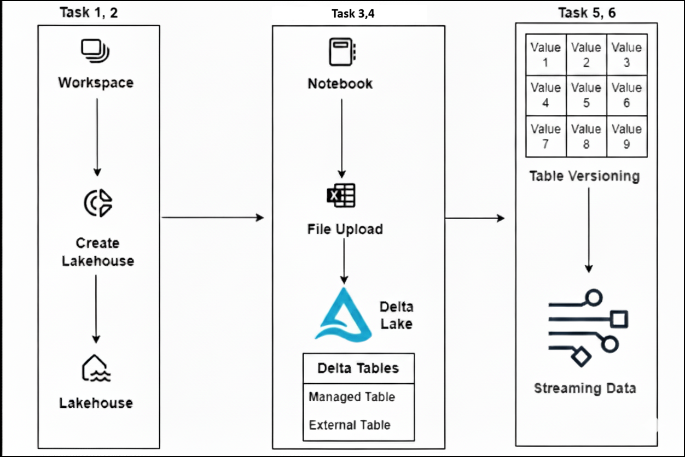

## Use delta tables in Apache Spark

Tables in a Microsoft Fabric lakehouse are based on the open source Delta Lake format for Apache Spark. Delta Lake adds support for relational semantics for both batch and streaming data operations, and enables the creation of a Lakehouse architecture in which Apache Spark can be used to process and query data in tables that are based on underlying files in a data lake.

## Task 1: Create a workspace

In this task, you will create a new workspace in Microsoft Fabric to use in this lab. By creating a workspace with the Fabric trial enabled, you can access the features of Microsoft Fabric needed to complete the tasks in this lab.

1. From your Lab-VM desktop, open the **Microsoft Edge Browser** and navigate to the following URL to sign in to **Microsoft Fabric** portal. 
    
    ```
    https://app.fabric.microsoft.com
    ```

          

1. Enter the following details to sign in:

   * Enter the **Email (1)** and then select **Submit (2)** to continue: <inject key="AzureAdUserEmail"></inject>

      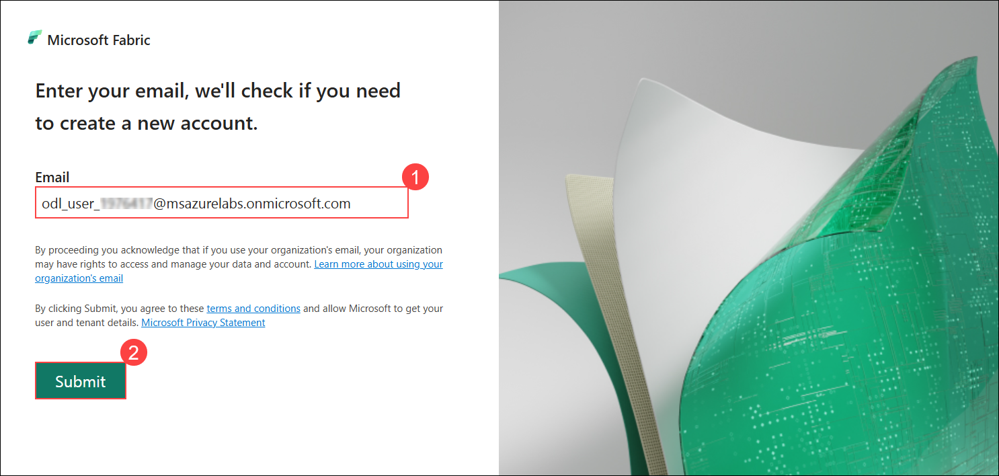

   * Enter the **Temporary Access Pass (1)** and select **Sign in (2)** to continue: <inject key="AzureAdUserPassword"></inject>

      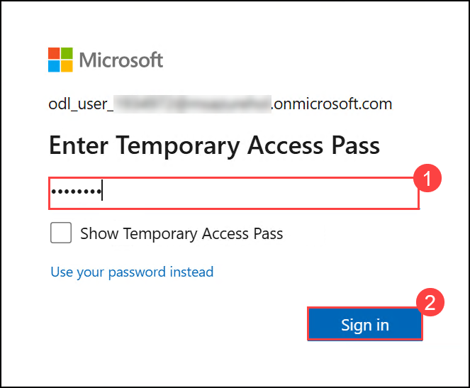

1. Select **No** for the Stay signed-in pop-up.

    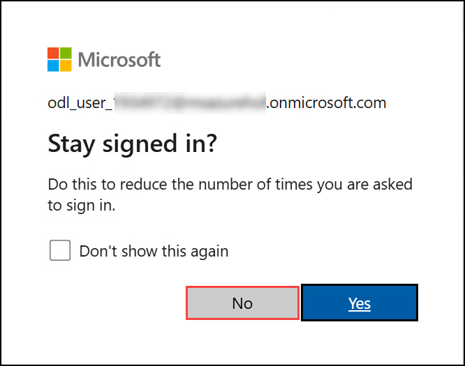   

1. Select **Cancel** on the **Welcome to the Fabric view** popup.

    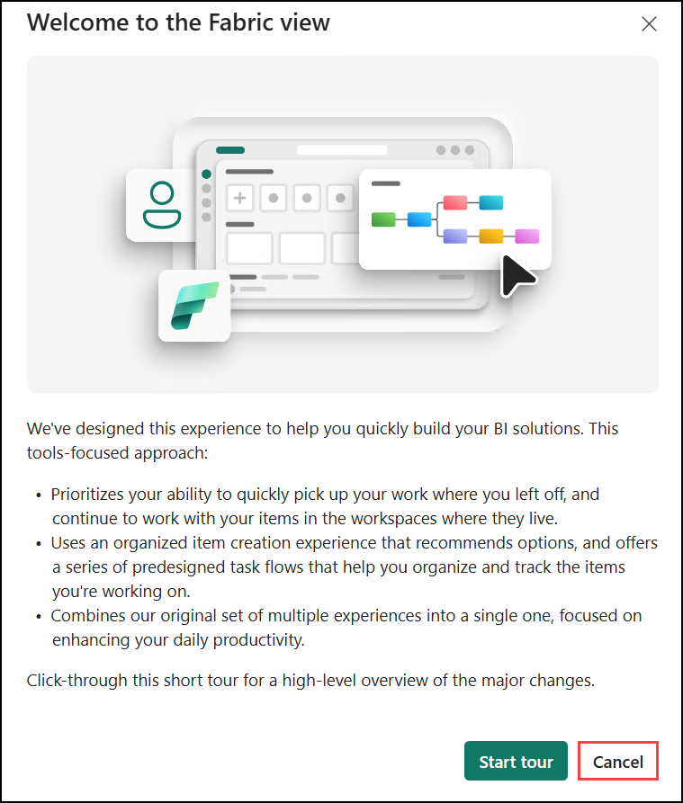

1. From the **Microsoft Fabric** home page, select the **Fabric (1)** icon from the left navigation pane, and then choose **Power BI (2)** from the menu that appears.

   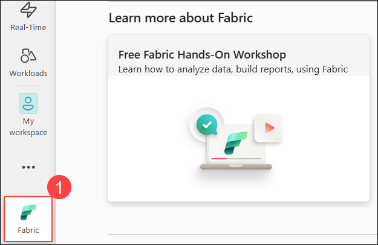

   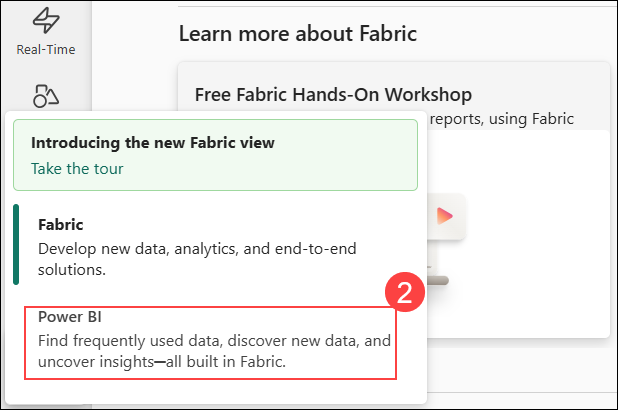

1. After switching to Power BI, you will be taken to the **Power BI** home page.

   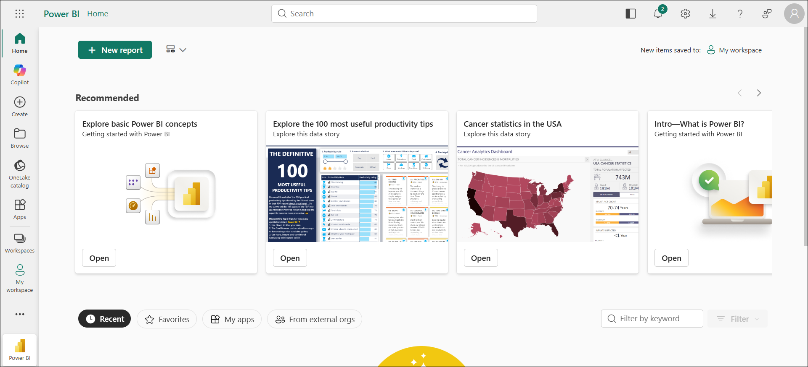 

1. From the **Power BI** home page, select **Account Manager (1)** in the top-right corner, and then choose **Free trial (2)** to start the Microsoft Fabric trial.

   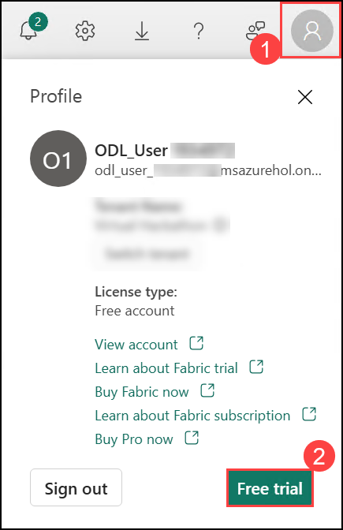  
   
    >📌**Note:** Fabric trial provides access to most features, but excludes Copilot, private links, and trusted workspace access ([learn more](https://learn.microsoft.com/en-us/fabric/fundamentals/fabric-trial#overview-of-the-trial-capacity)).

1. A new prompt will appear asking you to **Activate your 60-day free Fabric trial capacity**, click on **Activate**. This step enables the required Microsoft Fabric resources and compute capacity needed to perform the lab tasks, such as creating Lakehouses, running Spark notebooks, and building pipelines. Without activating the trial, these features and services will not be available for use.

   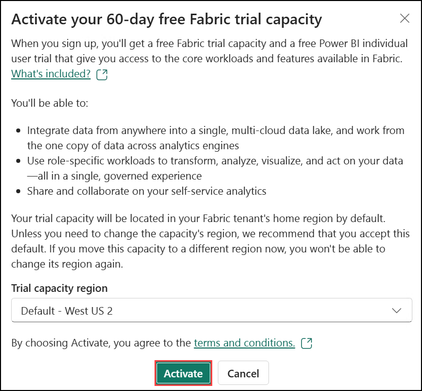     

1. Click **OK** on the Successfully upgraded to Microsoft Fabric popup. 

   

1. Close the **Invite teammates to try Fabric to extend your trail** pop-up. This ensures an uninterrupted setup process and allows you to focus on configuring your environment in Microsoft Fabric without distractions.

   
   
1. Open your **Account manager (1)** again. Notice that you now have a heading for **Trial Status (2)**. Your Account manager keeps track of the number of days remaining in your trial.

    

      >📌**Note:** You now have a **Fabric (Preview) trial** that includes a **Power BI trial** and a **Fabric (Preview) trial capacity**.

1. In the menu bar on the left, select **Workspaces (1)** (the icon looks similar to &#128455;). Select **+ New Workspace (2)**.

   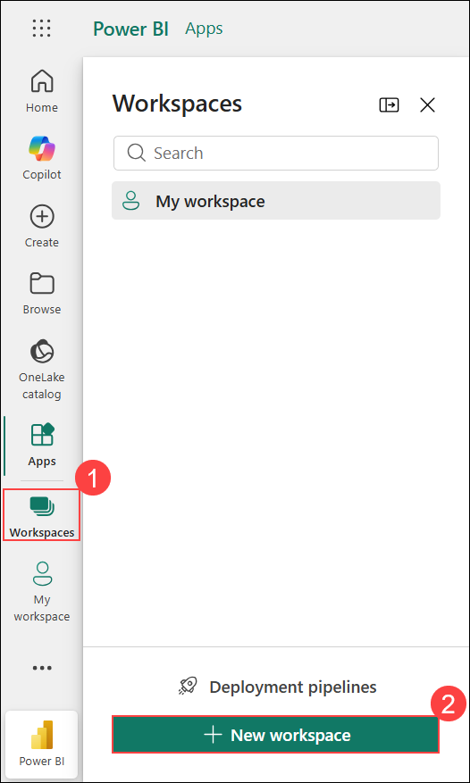

1. Create a new workspace with a name **dp_fabric-<inject key="DeploymentID" enableCopy="false" /> (1)**, scroll down to the **Advanced (2)** section to expand it, select **License mode** as **Fabric Trial (2)**, and click **Apply (4)**. This ensures the workspace is backed by Microsoft Fabric trial capacity, enabling you to use features like Lakehouses, Spark, and Data Factory pipelines required for the lab.

    

    

1. If the **Introducing task flows (preview)** popup appears, select **Got it** to continue.

    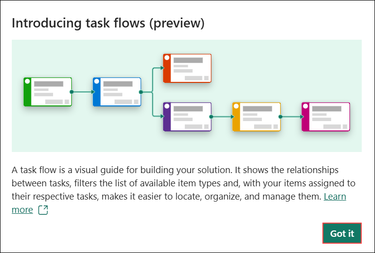
   
1. When your new workspace opens, it should be empty, as shown here:

    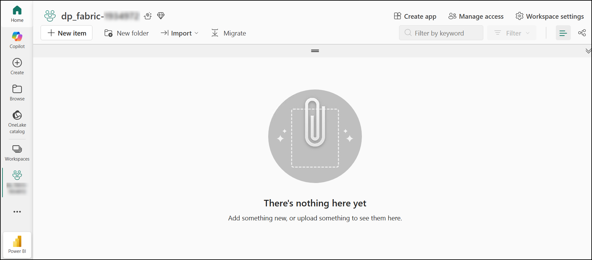

## Task 2: Create a lakehouse and upload data

In this task, you will create a new lakehouse in your workspace and upload a CSV file to it.

1. In the newly created workspace, click the **+ New Item (1)** button in the top-left corner of your workspace and search for **Lakehouse (2)** and select **Lakehouse (3)**. This step creates a centralized storage layer within Microsoft Fabric, where you can store, manage, and analyze data using Delta tables for the upcoming tasks.

   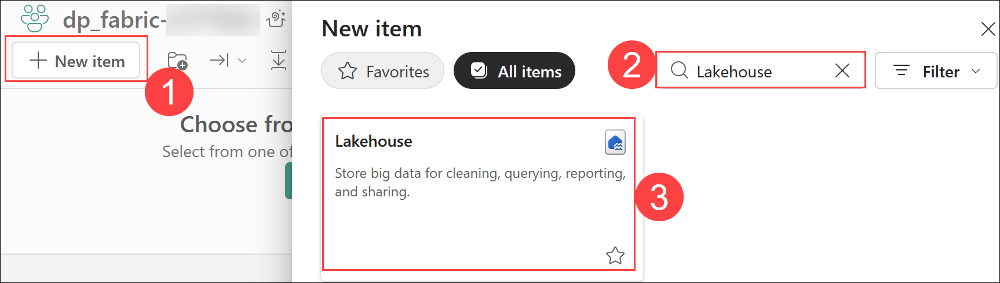
 
1. Create a new **Lakehouse** with the following details:

    - Name: **fabric_lakehouse (1)**
    - Location: Select your workspace. **(2)**
    - Lakehouse Scehme: Uncheck the box. **(3)**
    - Click **Create (4)** to create the lakehouse.

        
   
1. After a minute or so, a new empty lakehouse will appear. You will be ingesting some data into the lakehouse for analysis. There are multiple ways to do this, but in this lab, you'll upload a CSV file from the Lab-VM to your Lakhouse.

1. View the new lakehouse, and note that the **Lakehouse explorer** pane on the left enables you to browse tables and files in the lakehouse:
    
    - The **Tables** folder contains tables that you can query using SQL semantics. Tables in a Microsoft Fabric lakehouse are based on the open source *Delta Lake* file format, commonly used in Apache Spark.
    - The **Files** folder contains data files in the OneLake storage for the lakehouse that aren't associated with managed delta tables. You can also create *shortcuts* in this folder to reference data that is stored externally.
    - Currently, there are no tables or files in the lakehouse.

       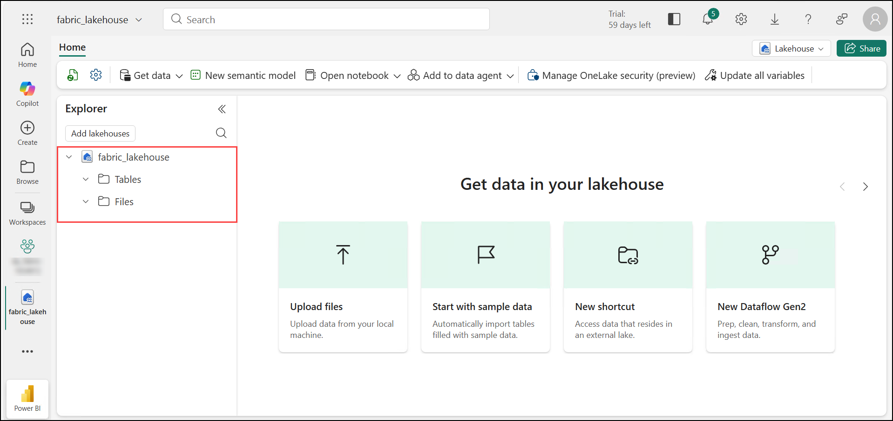

1. Click on the **ellipsis (...) (1)** menu for the **Files** folder in the **Explorer** pane, select **New subfolder (2)**.
   
   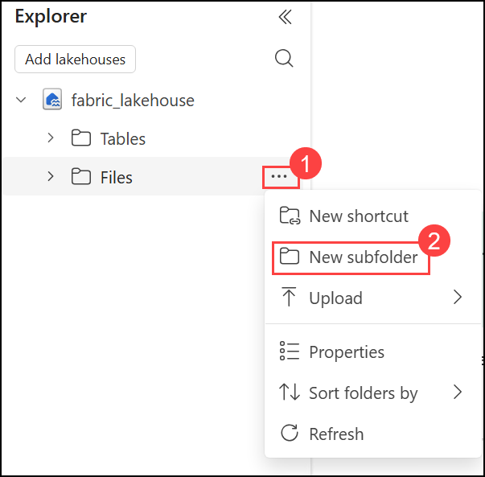
   
1. On the **New subfolder** popup, provide the folder name as **products (1)** and click **Create (2)**.

   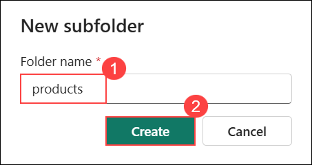

1. Right click on **products (1)** folder, select **Upload (2)**, and then choose **Upload files (3)**.

   

1. On the **Upload files** window, select the **folder icon** to choose the file to upload. This step allows you to bring raw data into the Lakehouse in Microsoft Fabric, which will be used in later steps for exploration, transformation, and creating Delta tables.

   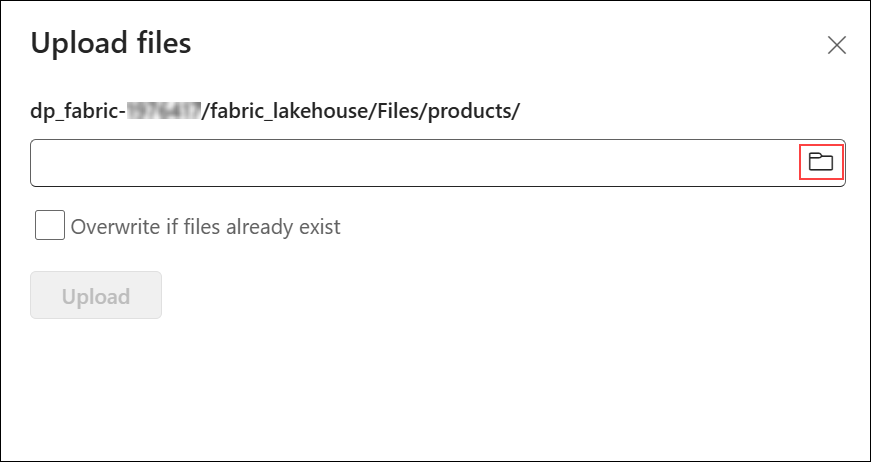

1. Navigate to **C:\LabFiles\dp-data-main (1)** and select the **products.csv (2)** file to upload, then click **Open (3)**.

   

1. After selecting the file, verify that **products.csv (1)** is shown, then select **Upload (2)** to upload the file.

   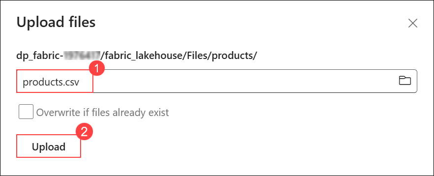

1. After the file has been uploaded, select the **products** folder, and verify that the **products.csv** file has been uploaded, as shown here:

    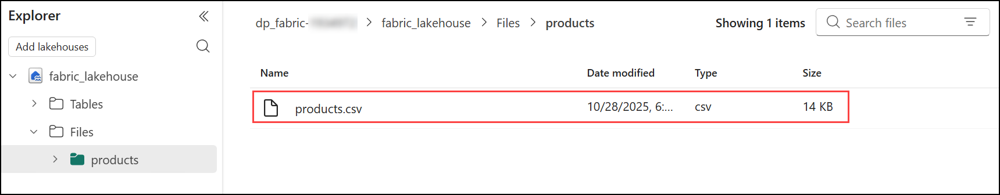

<!--
1. Download the data file for this exercise from [https://github.com/MicrosoftLearning/dp-data/raw/main/products.csv](https://github.com/MicrosoftLearning/dp-data/raw/main/products.csv), saving it as **products.csv** on your local computer (or lab VM if applicable).

    >**Note**: To download the file, open a new tab and paste the URL into the address bar.

    >Right-click anywhere on the page displaying the data and select Save as **products.csv (1)**, then choose **Save (2)** to download the file as **products.csv**.

    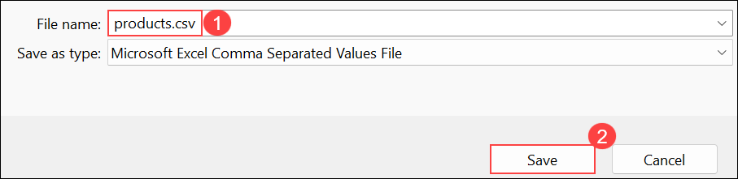

      - **OR**, if you are using the lab virtual machine (lab VM), navigate to **C:\LabFiles\dp-data-main (1)** and select **products.csv (2)** to use the file.

        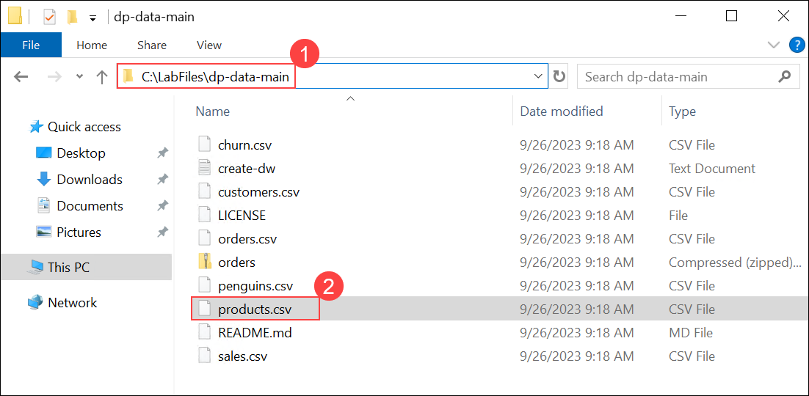
-->

## Task 3: Explore data in a dataframe

In this task, you'll use a Fabric notebook to load and view the data you uploaded into your lakehouse. By reading the CSV file into a Spark dataframe, you can explore the structure and contents of the data before transforming it in later steps. This helps verify that the file was uploaded correctly and lets you preview the dataset using Spark’s built-in display capabilities.

1. On the **Home (1)** page, click the **3-dots (1)** on the top command bar, select the **Open notebook (3)** menu and select **New notebook (4)** while viewing the contents of the **products** folder.

    

    **Note:** After a few seconds, a new notebook containing a single *cell* will open. Notebooks are made up of one or more cells that can contain *code* or *markdown* (formatted text).

1. If the AI tools introduction screen appears, select **Skip tour** to continue.

    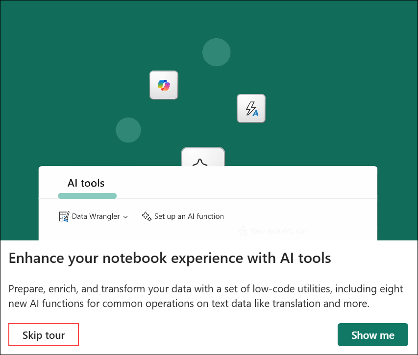

1. Select the existing cell in the notebook, which contains some simple code, and then use its **&#128465;** (*Delete*) icon at its top-right to remove it - you will not need this code.

    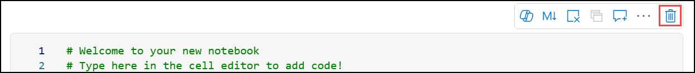

1. In the **Lakehouse explorer**, expand **Files (1)** and then select **products (2)** to view the **products.csv (3)** file you uploaded earlier.

    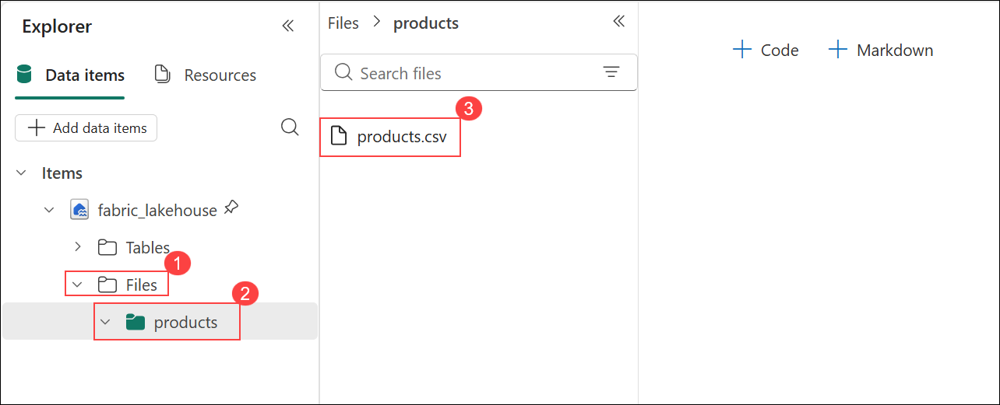

    >📌**Note:** If you are not able to find **Lakehouse explorer**, under the **Explorer** pane, expand Items and expand the lakehouse, you will now see the lakehouse explorer.

1. In the **ellipsis (...)** menu for **products.csv (1)**, select **Load data (2)** > **Spark (3)**. This action automatically generates a Spark code cell in the notebook, allowing you to quickly load and explore the data as a DataFrame in Microsoft Fabric without writing code from scratch. 

    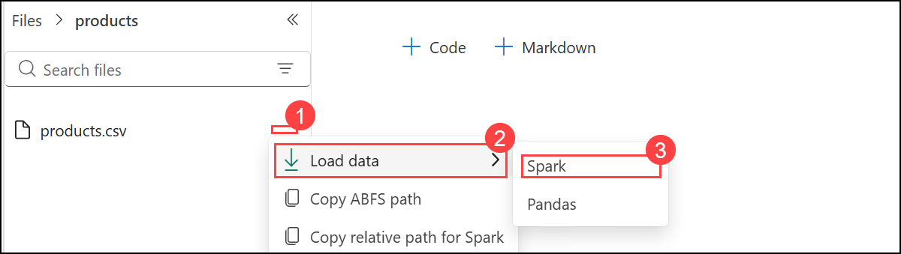

   A new code cell containing the following code should be added to the notebook. This code reads the CSV file into a Spark DataFrame with column headers and displays it in the notebook for exploration in Microsoft Fabric.

    ```python
    df = spark.read.format("csv").option("header","true").load("Files/products/products.csv")
    # df now is a Spark DataFrame containing CSV data from "Files/products/products.csv".
    display(df)
    ```

    > 💡**Tip**: You can hide the pane containing the files on the left by using its **<<** icon. Doing so will help you focus on the notebook.

1. Use the **&#9655;** (*Run cell*) button on the left of the cell to run it.

    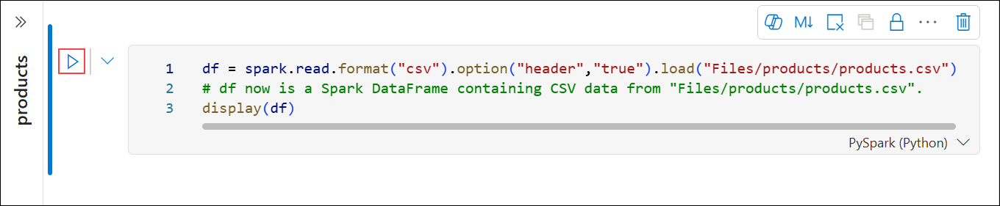

    > 📌**Note**: Since this is the first time you've run any Spark code in this notebook, a Spark session must be started. This means that the first run can take a minute or so to complete. Subsequent runs will be quicker.

1. When the cell command has completed, review the output below the cell, which should look similar to this:

     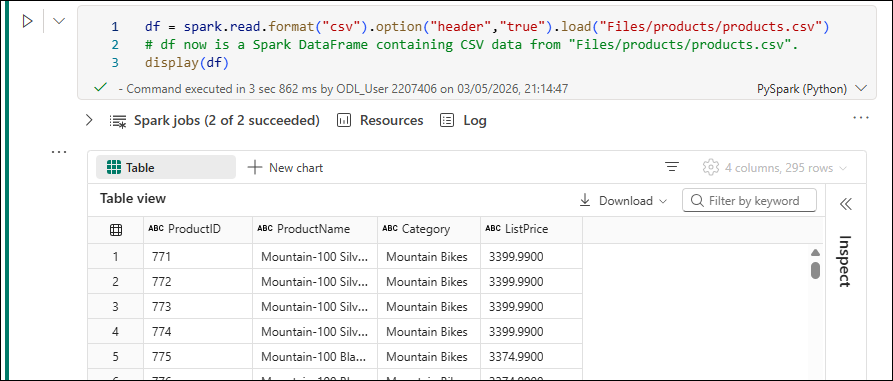

    >📌**Note:** If you are getting errors here and also getting a table, then please ignore the errors and move on to further tasks.

## Task 4: Create delta tables

In this task, you will create delta tables based on the data in the dataframe. You can save the dataframe as a delta table by using the `saveAsTable` method. Delta Lake supports the creation of both *managed* and *external* tables.

### Create a *managed* table

*Managed* tables are tables for which both the schema metadata and the data files are managed by Fabric. The data files for the table are created in the **Tables** folder.

1. Under the results returned by the first code cell, use the **+ Code** button to add a new code cell

   

    > 📌**Note:** If the **+ Code** button isn’t visible, hover your mouse in the empty notebook area; the option will appear.

1. Enter the following code in the new cell and select **Run** to execute it. This code writes the DataFrame to a managed Delta table named **managed_products**, storing it in the Lakehouse within Microsoft Fabric for scalable and reliable data processing.

    ```python
   df.write.format("delta").saveAsTable("managed_products")
    ```

   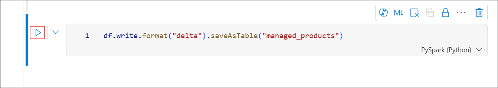

1. In the **Lakehouse explorer**, open the **ellipsis (...) menu (1)** for the **Tables** folder and select **Refresh (2)**.

   

1. Expand the **Tables** folder and verify that the **managed_products** table has been created.

   

### Create an *external* table

You can also create *external* tables for which the schema metadata is defined in the metastore for the lakehouse, but the data files are stored in an external location.

1. Select **+ Code** to add a new code cell.

   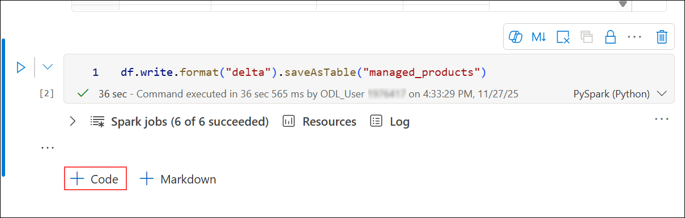

   > 📌**Note:** If the **+ Code** button doesn’t appear, move your mouse around the empty notebook area; it will show up when you hover.

1. And add the following code to it. This code writes the DataFrame as a Delta table named **external_products** at the specified ABFS (Azure Blob File System) path, creating an external table in Microsoft Fabric.

    ```python
   df.write.format("delta").saveAsTable("external_products", path="<abfs_path>/external_products")
    ```

    **Note:** We will be replacing the **abfs_path** placeholder with our ABFS.

1. In the **Lakehouse explorer** pane, in the **ellipsis (...) (1)** menu for the **Files** folder, select **Copy ABFS path (2)**.

    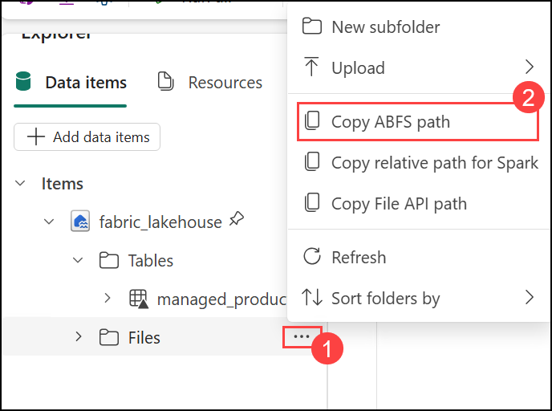

    The ABFS path is the fully qualified path to the **Files** folder in the OneLake storage for your lakehouse - similar to this: *abfss://workspace@tenant-onelake.dfs.fabric.microsoft.com/lakehousename.Lakehouse/Files*

1. In the code you entered into the code cell, replace **<abfs_path>** with the path you copied to the clipboard so that the code saves the dataframe as an external table with data files in a folder named **external_products** in your **Files** folder location. The full path should look similar to this:

    *abfss://workspace@tenant-onelake.dfs.fabric.microsoft.com/lakehousename.Lakehouse/Files/external_products*

1. After replacing **<abfs_path>** with the correct ABFS path, select **Run** to execute the cell.

   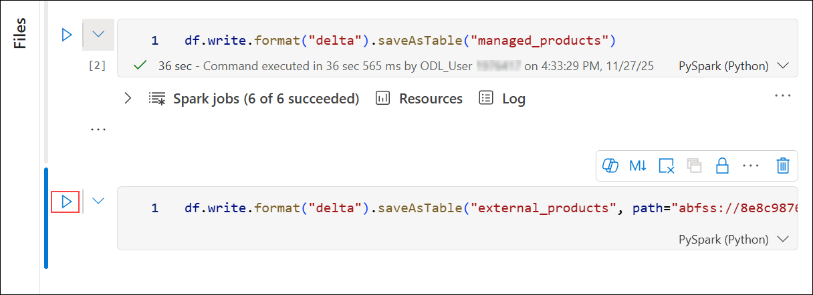

1. In the **Lakehouse explorer**, open the **ellipsis (...) menu (1)** for the **Tables** folder and select **Refresh (2)**. Then expand **Tables** and verify that the **external_products (3)** table has been created.

   

1. In the **Lakehouse explorer**, right click on **Files** folder and select **Refresh (1)**. Then expand **Files** and verify that the **external_products (2)** folder has been created.

   

### Compare *managed* and *external* tables

Let's explore the differences between managed and external tables.

1. Add another code cell and run the following code. This SQL command displays detailed metadata about the **managed_products** table such as its schema, storage location, and properties within Microsoft Fabric.

    ```sql
   %%sql

   DESCRIBE FORMATTED managed_products;
    ```
   
   The output will look similar to this:

    
   
   In the results, view the **Location** property for the table, which should be a path to the OneLake storage for the lakehouse ending with **/Tables/managed_products** (you may need to widen the **Data type** column to see the full path).

1. Modify the `DESCRIBE` command to show the details of the **external_products** table as shown here. This SQL command displays detailed metadata for the **external_products** table such as its schema, storage location, and properties within Microsoft Fabric.

    ```sql
   %%sql

   DESCRIBE FORMATTED external_products;
    ```

   The output will look similar to this:

    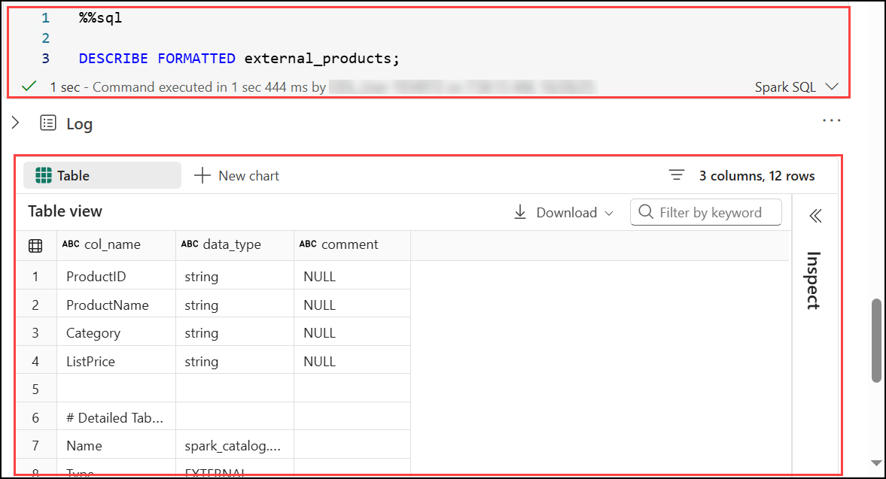

   In the results, view the **Location** property for the table, which should be a path to the OneLake storage for the lakehouse ending with **/Files/external_products** (you may need to widen the **Data type** column to see the full path).

    The files for the managed table are stored in the **Tables** folder in the OneLake storage for the lakehouse. In this case, a folder named **managed_products** has been created to store the Parquet files and the **_delta_log** folder for the table you created.

1. Add another code cell and run the following code. This SQL command deletes the **managed_products** and **external_products** tables from Microsoft Fabric, removing their metadata (and for managed tables, the underlying data as well).

    ```sql
   %%sql

   DROP TABLE managed_products;
   DROP TABLE external_products;
    ```

1. In the **Lakehouse explorer**, open the **ellipsis (...) menu (1)** for the **Tables** folder and select **Refresh (2)**. Then expand **Tables (3)** and verify that no tables are listed now.

    

1. In the **Lakehouse explorer** pane, expand the **Files** folder and verify that the **external_products (1)** has not been deleted. Select this folder to view the **Parquet data files (2)** and **_delta_log** folder for the data that was previously in the **external_products** table. The table metadata for the external table was deleted, but the files were not affected.

    

### Use SQL to create a table

1. Add another code cell and run the following code. This SQL command creates a Delta table named **products** using data stored at the specified location (`Files/external_products`), registering it in Microsoft Fabric as an external table.

    ```sql
   %%sql

   CREATE TABLE products
   USING DELTA
   LOCATION 'Files/external_products';
    ```

1. In the **Lakehouse explorer**, open the **ellipsis (...) menu (1)** for the **Tables** folder and select **Refresh (2)**. Then expand the **products** table and verify that its schema fields match the original dataframe from the **external_products** folder.

   

1. Add another code cell and run the following code. This SQL command retrieves and displays all records from the **products** table for exploration in Microsoft Fabric.

    ```sql
   %%sql

   SELECT * FROM products;
   ```

   The output will look similar to this:
   
    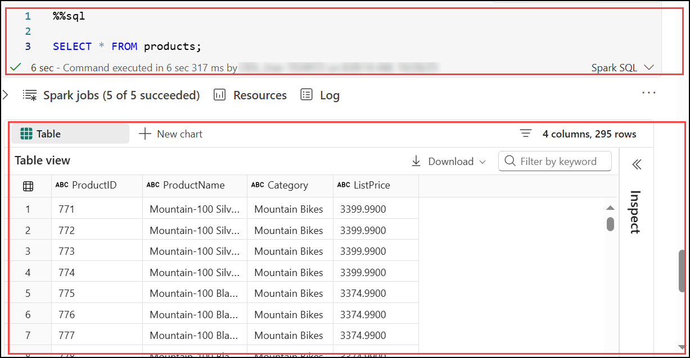

## Task 5: Explore table versioning

In this task, you will explore the versioning capabilities of delta tables. Transaction history for delta tables is stored in JSON files in the **delta_log** folder. You can use this transaction log to manage data versioning.

1. Add a new code cell to the notebook and run the following code. This SQL command updates the **products** table by applying a 10% discount to the ListPrice of all records where the category is ***Mountain Bikes*** in Microsoft Fabric.

    ```sql
   %%sql

   UPDATE products
   SET ListPrice = ListPrice * 0.9
   WHERE Category = 'Mountain Bikes';
    ```

    This code implements a 10% reduction in the price for mountain bikes.

    The output will look similar to this:

     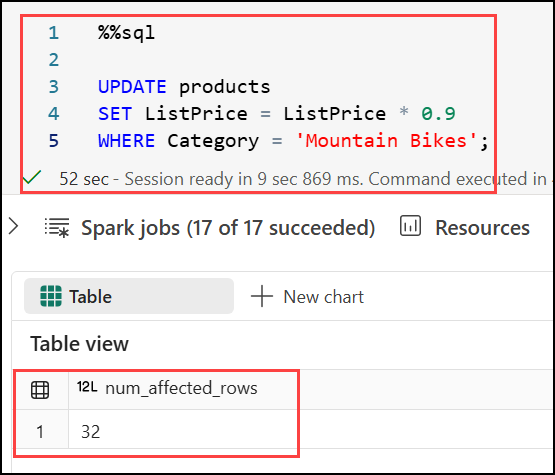

1. Add another code cell and run the following code. This SQL command displays the version history of the **products** Delta table including details of updates, timestamps, and operations within Microsoft Fabric.

    ```sql
   %%sql

   DESCRIBE HISTORY products;
    ```

    The results show the history of transactions recorded for the table.

    The output will look similar to this:

     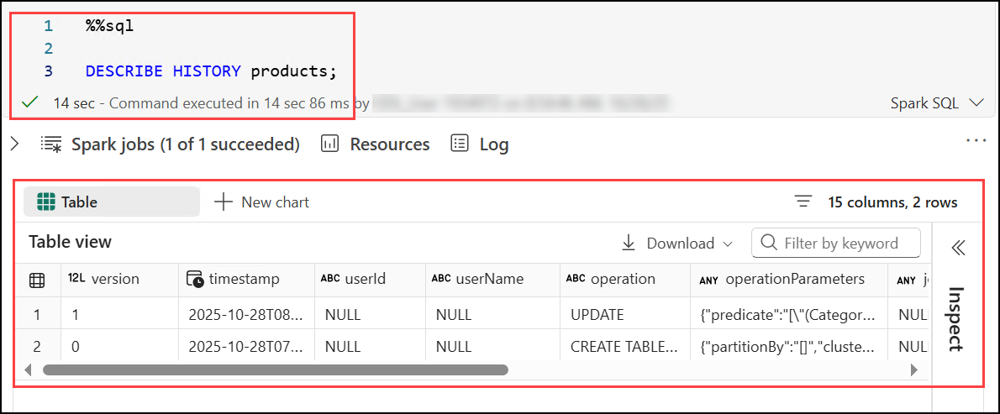

1. Add another code cell and run the following code. This code reads and displays the current version of the Delta table, then loads and displays version 0 (original data) using time travel, allowing you to compare changes over time in Microsoft Fabric.

    ```python
   delta_table_path = 'Files/external_products'

   # Get the current data
   current_data = spark.read.format("delta").load(delta_table_path)
   display(current_data)

   # Get the version 0 data
   original_data = spark.read.format("delta").option("versionAsOf", 0).load(delta_table_path)
   display(original_data)
    ```

    The results show two DataFrames — one containing the data after the price reduction, and the other showing the original version of the data.

    The output will look similar to this:

    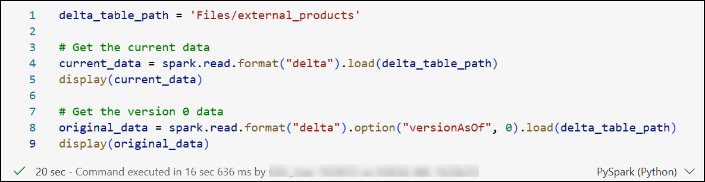
    
    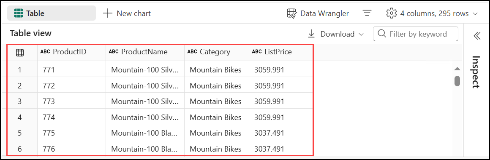
    
    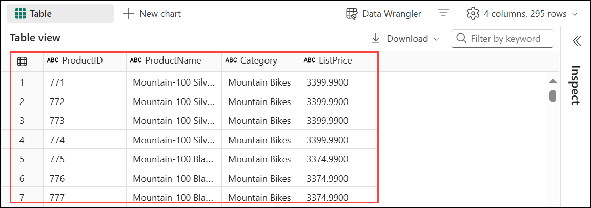

## Task 6: Use delta tables for streaming data

In this task, you will explore how to use delta tables for streaming data.

Delta Lake supports streaming data. Delta tables can be a *sink* or a *source* for data streams created using the Spark Structured Streaming API. In this example, you'll use a delta table as a sink for some streaming data in a simulated Internet of Things (IoT) scenario.

1. Add a new code cell in the notebook. Then, in the new cell, add the following code and run it. This code creates a folder, simulates streaming IoT data by writing JSON records to it, and sets up a Spark structured stream to read the data incrementally using a defined schema in Microsoft Fabric.

    ```python
   from notebookutils import mssparkutils
   from pyspark.sql.types import *
   from pyspark.sql.functions import *

   # Create a folder
   inputPath = 'Files/data/'
   mssparkutils.fs.mkdirs(inputPath)

   # Create a stream that reads data from the folder, using a JSON schema
   jsonSchema = StructType([
   StructField("device", StringType(), False),
   StructField("status", StringType(), False)
   ])
   iotstream = spark.readStream.schema(jsonSchema).option("maxFilesPerTrigger", 1).json(inputPath)

   # Write some event data to the folder
   device_data = '''{"device":"Dev1","status":"ok"}
   {"device":"Dev1","status":"ok"}
   {"device":"Dev1","status":"ok"}
   {"device":"Dev2","status":"error"}
   {"device":"Dev1","status":"ok"}
   {"device":"Dev1","status":"error"}
   {"device":"Dev2","status":"ok"}
   {"device":"Dev2","status":"error"}
   {"device":"Dev1","status":"ok"}'''
   mssparkutils.fs.put(inputPath + "data.txt", device_data, True)
   print("Source stream created...")
    ```

    Ensure the message *Source stream created...* is printed. The code you just ran has created a streaming data source based on a folder to which some data has been saved, representing readings from hypothetical IoT devices.

    The output will look similar to this:

     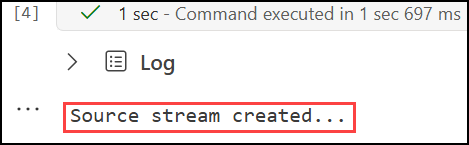

1. In a new code cell, add and run the following code. This code writes the streaming data to a Delta table while maintaining a checkpoint for fault tolerance, enabling reliable and continuous data ingestion in Microsoft Fabric.

    ```python
   # Write the stream to a delta table
   delta_stream_table_path = 'Tables/iotdevicedata'
   checkpointpath = 'Files/delta/checkpoint'
   deltastream = iotstream.writeStream.format("delta").option("checkpointLocation", checkpointpath).start(delta_stream_table_path)
   print("Streaming to delta sink...")
    ```

    This code writes the streaming device data in delta format to a folder named **iotdevicedata**. Because the folder is created under the **Tables** location, a table will automatically be created for it.

    The output will look similar to this:

     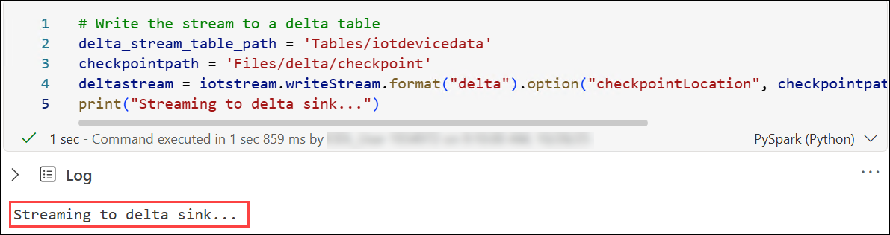

1. In a new code cell, add and run the following code. This SQL command queries and displays all records from the **IotDeviceData** table, allowing you to view the streamed data being ingested in real time within Microsoft Fabric.

    ```sql
   %%sql

   SELECT * FROM IotDeviceData;
    ```

    This code queries the **IotDeviceData** table, which contains the device data from the streaming source.

    The output will look similar to this:

     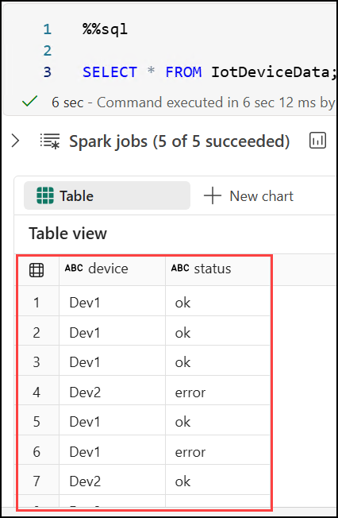

1. In a new code cell, add and run the following code. This code adds more JSON records to the source folder, simulating new incoming streaming data that will be automatically picked up and processed by the active stream in Microsoft Fabric.

    ```python
   # Add more data to the source stream
   more_data = '''{"device":"Dev1","status":"ok"}
   {"device":"Dev1","status":"ok"}
   {"device":"Dev1","status":"ok"}
   {"device":"Dev1","status":"ok"}
   {"device":"Dev1","status":"error"}
   {"device":"Dev2","status":"error"}
   {"device":"Dev1","status":"ok"}'''

   mssparkutils.fs.put(inputPath + "more-data.txt", more_data, True)
    ```

    This code writes more hypothetical device data to the streaming source.

    The output will look similar to this:

     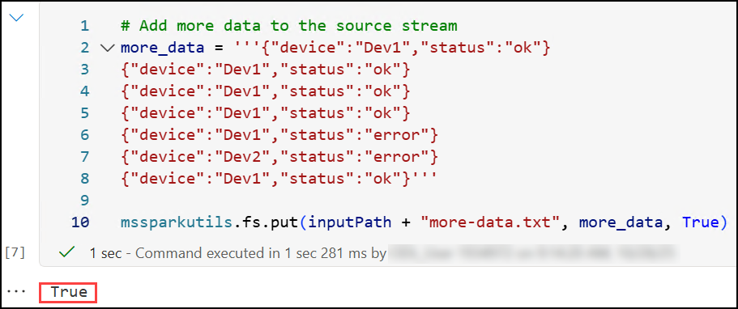

1. Re-run the cell containing the following code:

    ```sql
   %%sql

   SELECT * FROM IotDeviceData;
    ```

    This code queries the **IotDeviceData** table again, which should now include the additional data that was added to the streaming source.

1. In a new code cell, add and run the following code. This command stops the active streaming query, halting further data ingestion into the Delta table in Microsoft Fabric.

    ```python
   deltastream.stop()
    ```

    

    **Note:** This code stops the stream.

## 🧾 Summary

In this lab, you have successfully:

- Created a workspace and configured it with Microsoft Fabric trial capacity.
- Created a Lakehouse and uploaded raw data files for processing.
- Loaded and explored data using Apache Spark DataFrames.
- Created both managed and external Delta tables from the data.
- Queried, updated, and analyzed data using SQL.
- Explored Delta table versioning and used time travel to access previous data states.
- Implemented streaming data ingestion and wrote real-time data to Delta tables.

### You have successfully completed Lab 1. Click **Next >>** to proceed to the next lab.


