# Lab 01: Use Delta tables in Apache Spark

### Estimated Duration: 140 Minutes

## Overview

Tables in a Microsoft Fabric lakehouse are based on the Delta Lake storage format commonly used in Apache Spark. By using the enhanced capabilities of delta tables, you can create  advanced analytics solutions.

Delta Lake is an open-source storage layer that adds relational database semantics to Spark-based data lake processing. Tables in Microsoft Fabric lakehouses are Delta tables, which is signified by the triangular Delta (▴) icon on tables in the lakehouse user interface.

## Lab Objectives

In this lab, you will complete the following tasks:

- Task 1: Create a workspace
- Task 2: Create a lakehouse and upload data
- Task 3: Explore data in a dataframe
- Task 4: Create delta tables
- Task 5: Explore table versioning
- Task 6: Use delta tables for streaming data

## _Architecture Diagram_

   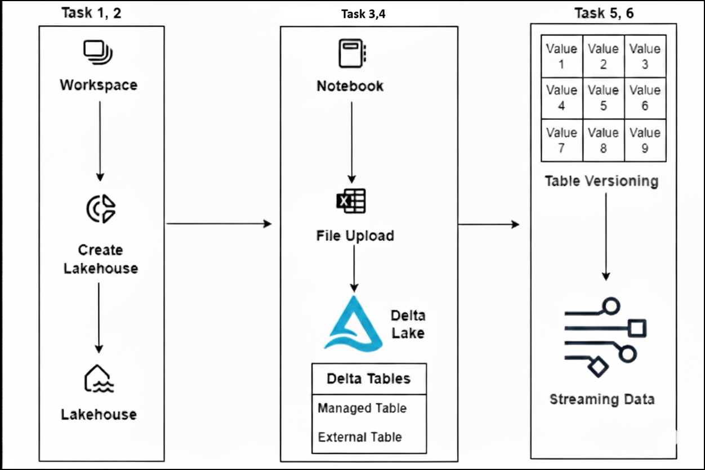

# Use delta tables in Apache Spark

Tables in a Microsoft Fabric lakehouse are based on the open source *Delta Lake* format for Apache Spark. Delta Lake adds support for relational semantics for both batch and streaming data operations, and enables the creation of a Lakehouse architecture in which Apache Spark can be used to process and query data in tables that are based on underlying files in a data lake.

## Task 1: Create a workspace

Before working with data in Fabric, create a workspace with the Fabric trial enabled.

1. Open the Edge Browser to Sign in to [Microsoft Fabric](https://app.fabric.microsoft.com). 
    
    ```
    https://app.fabric.microsoft.com
    ```

   * Enter the following **Email (1)** and then select **Submit (2)** to continue: <inject key="AzureAdUserEmail"></inject>

      

   * Enter the following **Temporary Access Pass (1)** and select **Sign in (2)** to continue: <inject key="AzureAdUserPassword"></inject>

      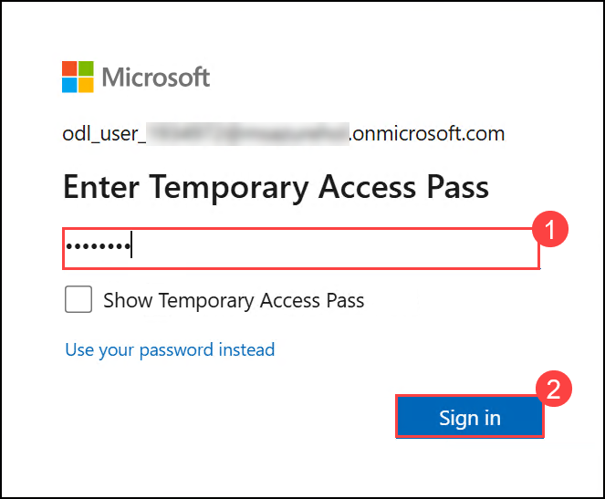

1. Select **No** for the Stay signed-in pop-up.

    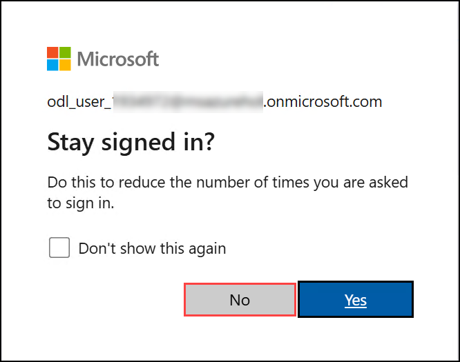   

1. Select **Cancel** on the **Welcome to the Fabric view** popup.

    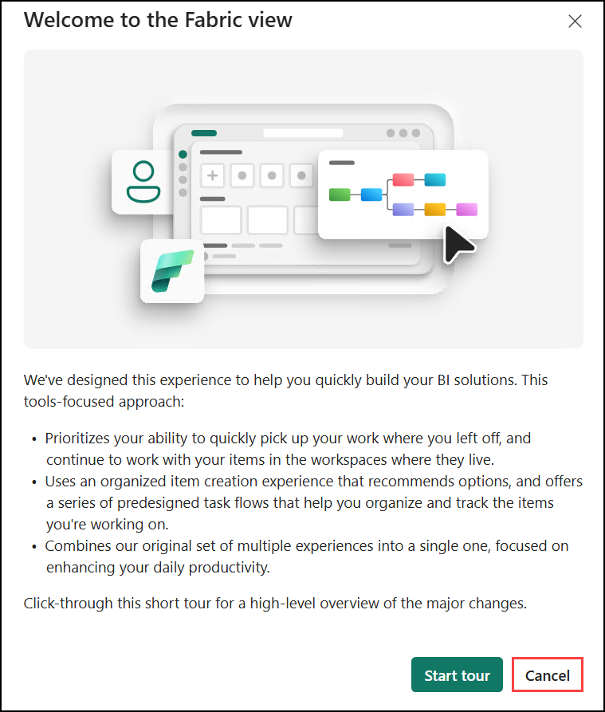

1. From the Microsoft Fabric home page, select the **Fabric (1)** icon from the left navigation pane, and then choose **Power BI (2)** from the menu that appears.

   

   

1. After switching to Power BI, you will be taken to the Power BI home page.

    

1. From the Power BI home page, select **Account Manager (1)** in the top-right corner, and then choose **Free trial (2)** to start the Microsoft Fabric trial.

   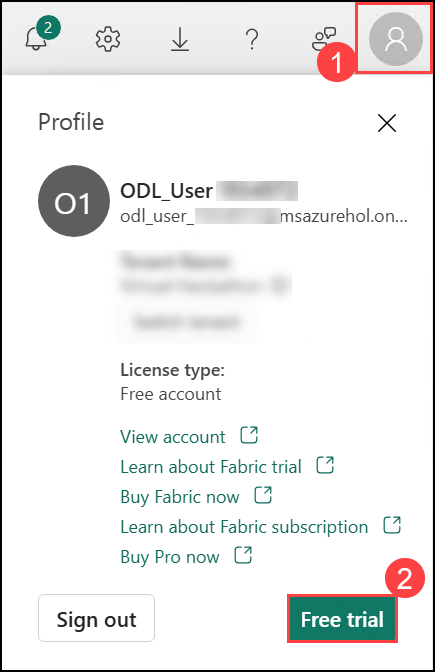  
   
1. A new prompt will appear asking you to **Activate your 60-day free Fabric trial capacity**, click on **Activate**.

   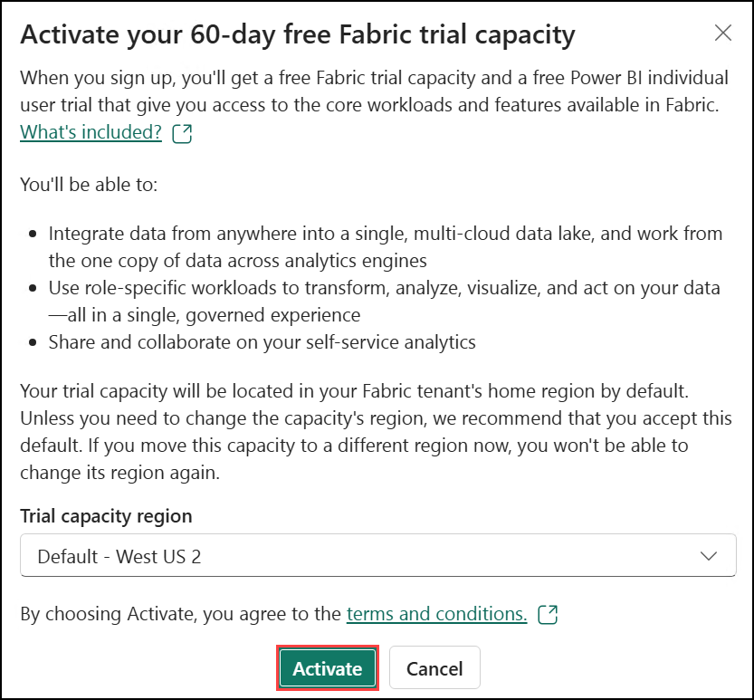     
   
1. Once your trial capacity is ready, you receive a confirmation message. Select **Stay on current page** to begin working in Fabric.

    
   
1. Close the popups. Open your **Account manager (1)** again. Notice that you now have a heading for **Trial Status (2)**. Your Account manager keeps track of the number of days remaining in your trial.

    

      >**Note:** You now have a **Fabric (Preview) trial** that includes a **Power BI trial** and a **Fabric (Preview) trial capacity**.

1. In the menu bar on the left, select **Workspaces (1)** (the icon looks similar to &#128455;). Select **+ New Workspace (2)**.

   

1. Create a new workspace with a name **dp_fabric-<inject key="DeploymentID" enableCopy="false" /> (1)**, scroll down to **Advanced (2)** section and expand it , select **License mode** as **Trial (2)**, and click on **Apply (4)**

    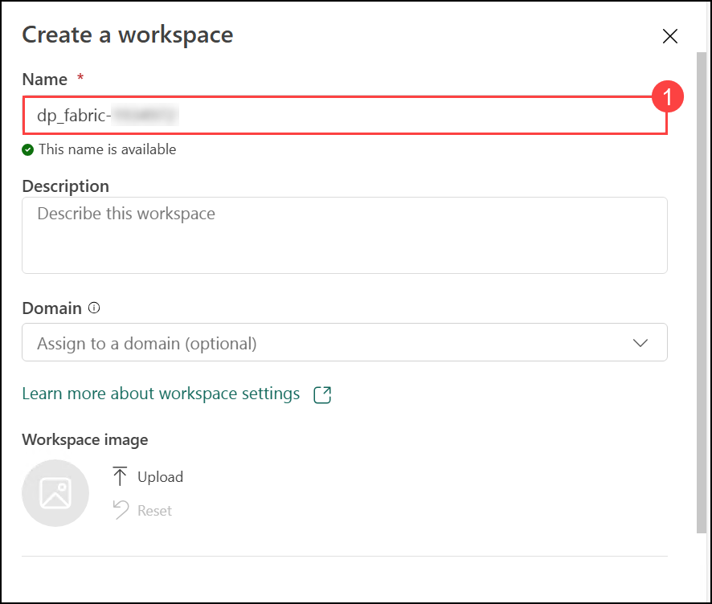

    

1. If the **Introducing task flows (preview)** popup appears, select **Got it** to continue.

    
   
1. When your new workspace opens, it should be empty, as shown here:

    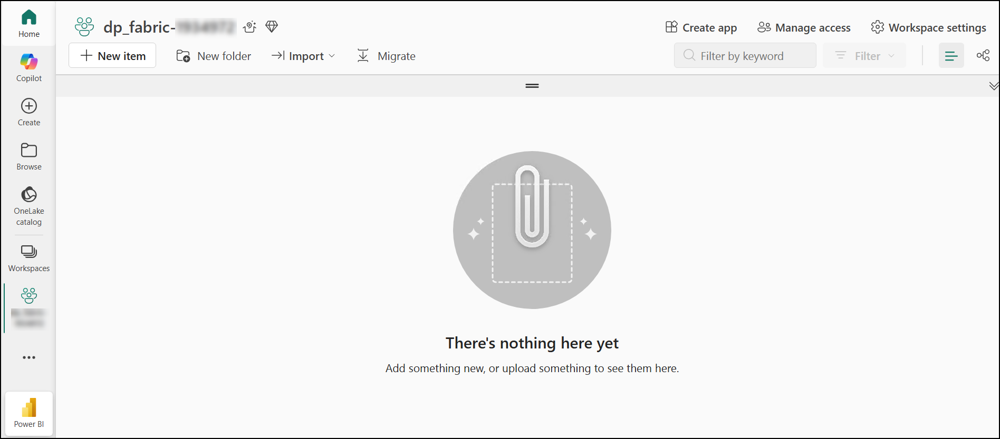

## Task 2: Create a lakehouse and upload data

Now your workspace is ready, let’s create a new Lakehouse to store and analyze your data.

1. In the newly created workspace, click the **+ New Item (1)** button and search for **Lakehouse (2)** and select **Lakehouse (3)**.

   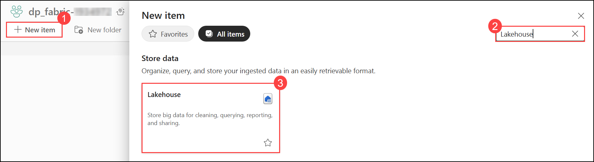
 
1. Create a new **Lakehouse** with a name **fabric_lakehouse (1)**, uncheck the box of **Lakehouse schemas (2)** and click on **Create (3)**.

   
   
    After a minute or so, a new empty lakehouse. You need to ingest some data into the data lakehouse for analysis. There are multiple ways to do this, but in this exercise, you'll simply download a text file to your local computer (or lab VM if applicable) and then upload it to your lakehouse.

1. View the new lakehouse, and note that the **Lakehouse explorer** pane on the left enables you to browse tables and files in the lakehouse:
    
     - The **Tables** folder contains tables that you can query using SQL semantics. Tables in a Microsoft Fabric lakehouse are based on the open source *Delta Lake* file format, commonly used in Apache Spark.
     - The **Files** folder contains data files in the OneLake storage for the lakehouse that aren't associated with managed delta tables. You can also create *shortcuts* in this folder to reference data that is stored externally.
     - Currently, there are no tables or files in the lakehouse.

       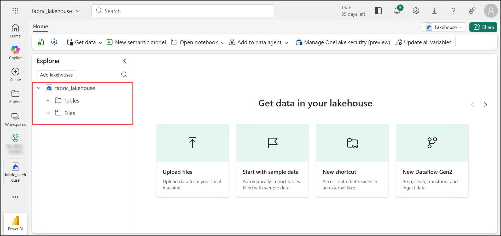

1. Download the data file for this exercise from [https://github.com/MicrosoftLearning/dp-data/raw/main/products.csv](https://github.com/MicrosoftLearning/dp-data/raw/main/products.csv), saving it as **products.csv** on your local computer (or lab VM if applicable).

   >**Note**: To download the file, open a new tab in the browser and paste it into the URL.
   
   >Right-click anywhere on the page displaying the data and select Save as  **products.csv (1)**, then choose **Save (2)** to download the file as **products.csv**.

    

      - **OR**, if you are using the lab virtual machine (lab VM), navigate to **C:\LabFiles\dp-data-main (1)** and select **products.csv (2)** to use the file.

        

1. Return to the web browser tab containing your lakehouse, and in the **ellipsis (...) (1)** menu for the **Files** folder in the **Explorer** pane, select **New subfolder (2)**.
   
   
   
1. On **New subfolder** pop up, provide the Folder name as **products (1)** and click on **Create (2)**.

   

1. In the **products (1)** folder, open the **ellipsis (...)** menu, select **Upload (2)**, and then choose **Upload files (3)**.

   

1. On the **Upload files** window, select the **folder icon** and choose the **products.csv** file to upload.

   

1. After selecting the file, verify that **products.csv (1)** is shown, then select **Upload (2)** to upload the file.

   

1. After the file has been uploaded, select the **products** folder, and verify that the **products.csv** file has been uploaded, as shown here:

    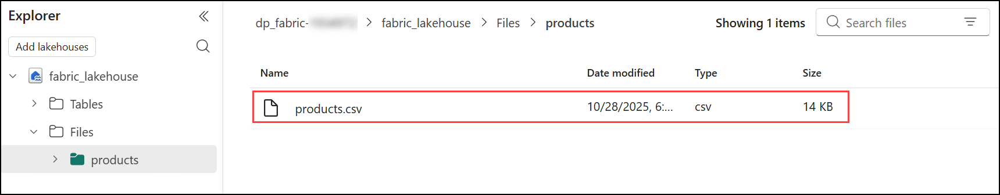

## Task 3: Explore data in a dataframe

1. On the **Home (1)** page, open the **Open notebook (2)** menu and select **New notebook (3)** while viewing the contents of the **products** folder.

    

    **Note:** After a few seconds, a new notebook containing a single *cell* will open. Notebooks are made up of one or more cells that can contain *code* or *markdown* (formatted text).

1. If the AI tools introduction screen appears, select **Skip tour** to continue.

    

1. Select the existing cell in the notebook, which contains some simple code, and then use its **&#128465;** (*Delete*) icon at its top-right to remove it - you will not need this code.

    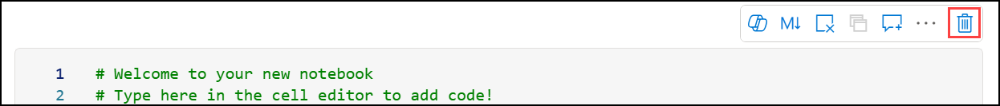

1. In the **Lakehouse explorer**, expand **Files (1)** and then select **products (2)** to view the **products.csv (3)** file you uploaded earlier.

    

    >**Note:** If you are not able to find **Lakehouse explorer**, under **Explorer** pane, expand Items and expand the lakehouse, you now see the lakehouse explorer.

1. In the **ellipsis (...)** menu for **products.csv (1)**, select **Load data (2)** > **Spark (3)**. A new code cell containing the following code should be added to the notebook:

    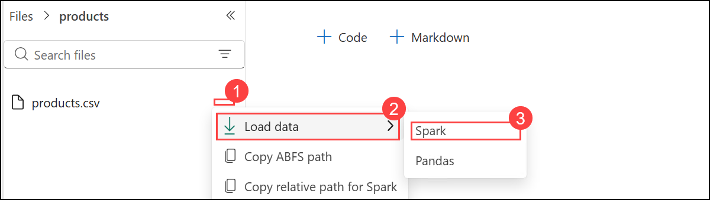

    ```python
    df = spark.read.format("csv").option("header","true").load("Files/products/products.csv")
    # df now is a Spark DataFrame containing CSV data from "Files/products/products.csv".
    display(df)
    ```

    > **Tip**: You can hide the pane containing the files on the left by using its **<<** icon. Doing so will help you focus on the notebook.

1. Use the **&#9655;** (*Run cell*) button on the left of the cell to run it.

    

    > **Note**: Since this is the first time you've run any Spark code in this notebook, a Spark session must be started. This means that the first run can take a minute or so to complete. Subsequent runs will be quicker.

1. When the cell command has completed, review the output below the cell, which should look similar to this:

     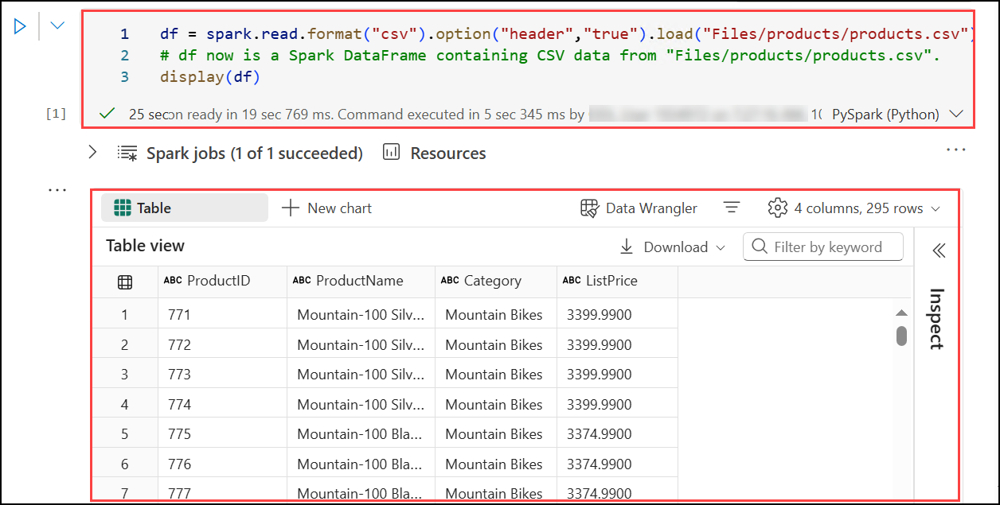

    >**Note:** If you are getting errors here and also getting a table, then please ignore the errors and move on to further tasks.

## Task 4: Create delta tables

You can save the dataframe as a delta table by using the `saveAsTable` method. Delta Lake supports the creation of both *managed* and *external* tables.

### Create a *managed* table

*Managed* tables are tables for which both the schema metadata and the data files are managed by Fabric. The data files for the table are created in the **Tables** folder.

1. Under the results returned by the first code cell, use the **+ Code** button to add a new code cell

   

    > **Note:** If the **+ Code** button isn’t visible, hover your mouse in the empty notebook area the option will appear.

1. Enter the following code in the new cell and select **Run (1)** to execute it:

    ```python
   df.write.format("delta").saveAsTable("managed_products")
    ```

   

1. In the **Lakehouse explorer**, open the **ellipsis (...) menu (1)** for the **Tables** folder and select **Refresh (2)**.

   

1. Expand the **Tables** folder and verify that the **managed_products** table has been created.

   

### Create an *external* table

You can also create *external* tables for which the schema metadata is defined in the metastore for the lakehouse, but the data files are stored in an external location.

1. Select **+ Code** to add another new code cell.

   

   > **Note:** If the **+ Code** button doesn’t appear, move your mouse around the empty notebook area, it will show up when you hover.

1. And add the following code to it:

    ```python
   df.write.format("delta").saveAsTable("external_products", path="<abfs_path>/external_products")
    ```

    **Note:** Make sure to replace the **abfs_path**.

1. In the **Lakehouse explorer** pane, in the **ellipsis (...) (1)** menu for the **Files** folder, select **Copy ABFS path (2)**.

    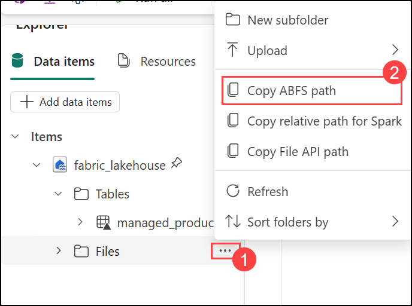

    The ABFS path is the fully qualified path to the **Files** folder in the OneLake storage for your lakehouse - similar to this: *abfss://workspace@tenant-onelake.dfs.fabric.microsoft.com/lakehousename.Lakehouse/Files*

1. In the code you entered into the code cell, replace **<abfs_path>** with the path you copied to the clipboard so that the code saves the dataframe as an external table with data files in a folder named **external_products** in your **Files** folder location. The full path should look similar to this:

    *abfss://workspace@tenant-onelake.dfs.fabric.microsoft.com/lakehousename.Lakehouse/Files/external_products*

1. After replacing **<abfs_path>** with the correct ABFS path, select **Run** to execute the cell.

   

1. In the **Lakehouse explorer**, open the **ellipsis (...) menu (1)** for the **Tables** folder and select **Refresh (2)**. Then expand **Tables** and verify that the **external_products (3)** table has been created.

   

1. In the **Lakehouse explorer**, open the **ellipsis (...) menu (1)** for the **Files** folder and select **Refresh (2)**. Then expand **Files** and verify that the **external_products (3)** folder has been created.

   

### Compare *managed* and *external* tables

Let's explore the differences between managed and external tables.

1. Add another code cell and run the following code:

    ```sql
   %%sql

   DESCRIBE FORMATTED managed_products;
    ```
   
   The output will look similar to this:

    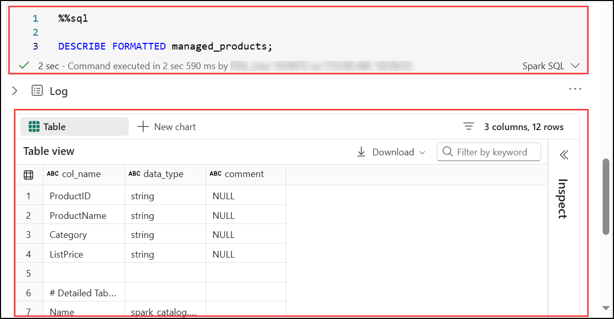
   
   In the results, view the **Location** property for the table, which should be a path to the OneLake storage for the lakehouse ending with **/Tables/managed_products** (you may need to widen the **Data type** column to see the full path).

1. Modify the `DESCRIBE` command to show the details of the **external_products** table as shown here:

    ```sql
   %%sql

   DESCRIBE FORMATTED external_products;
    ```

   The output will look similar to this:

    

   In the results, view the **Location** property for the table, which should be a path to the OneLake storage for the lakehouse ending with **/Files/external_products** (you may need to widen the **Data type** column to see the full path).

    The files for the managed table are stored in the **Tables** folder in the OneLake storage for the lakehouse. In this case, a folder named **managed_products** has been created to store the Parquet files and **delta_log** folder for the table you created.

1. Add another code cell and run the following code:

    ```sql
   %%sql

   DROP TABLE managed_products;
   DROP TABLE external_products;
    ```

1. In the **Lakehouse explorer**, open the **ellipsis (...) menu (1)** for the **Tables** folder and select **Refresh (2)**. Then expand **Tables** and verify that no tables are listed.

    

1. In the **Lakehouse explorer** pane, expand the **Files** folder and verify that the **external_products (1)** has not been deleted. Select this folder to view the **Parquet data files (2)** and **_delta_log** folder for the data that was previously in the **external_products** table. The table metadata for the external table was deleted, but the files were not affected.

    

### Use SQL to create a table

1. Add another code cell and run the following code:

    ```sql
   %%sql

   CREATE TABLE products
   USING DELTA
   LOCATION 'Files/external_products';
    ```

1. In the **Lakehouse explorer**, open the **ellipsis (...) menu (1)** for the **Tables** folder and select **Refresh**. Then expand the **products (1)** table and verify that its schema fields (2) match the original dataframe from the **external_products** folder.

   

1. Add another code cell and run the following code:

    ```sql
   %%sql

   SELECT * FROM products;
   ```

   The output will look similar to this:
   
    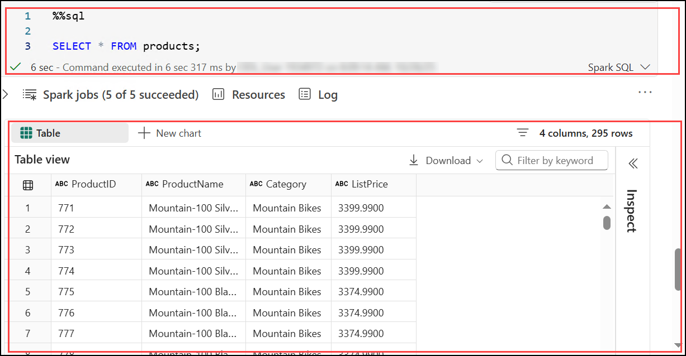

## Task 5: Explore table versioning

Transaction history for delta tables is stored in JSON files in the **delta_log** folder. You can use this transaction log to manage data versioning.

1. Add a new code cell to the notebook and run the following code:

    ```Python
   %%sql

   UPDATE products
   SET ListPrice = ListPrice * 0.9
   WHERE Category = 'Mountain Bikes';
    ```

    This code implements a 10% reduction in the price for mountain bikes.

    The output will look similar to this:

     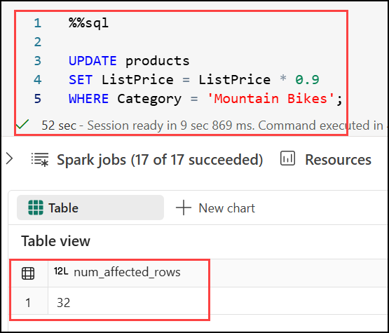

1. Add another code cell and run the following code:

    ```sql
   %%sql

   DESCRIBE HISTORY products;
    ```

    The results show the history of transactions recorded for the table.

    The output will look similar to this:

     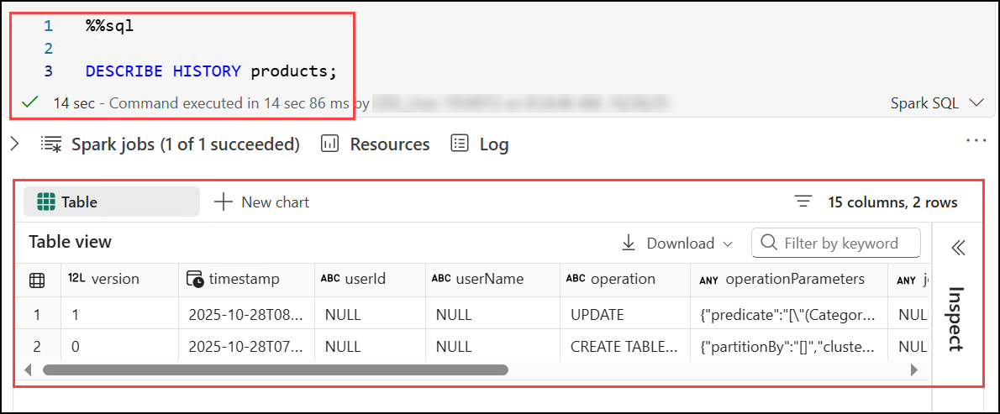

1. Add another code cell and run the following code:

    ```python
   delta_table_path = 'Files/external_products'

   # Get the current data
   current_data = spark.read.format("delta").load(delta_table_path)
   display(current_data)

   # Get the version 0 data
   original_data = spark.read.format("delta").option("versionAsOf", 0).load(delta_table_path)
   display(original_data)
    ```

    The results show two dataframes - one containing the data after the price reduction, and the other showing the original version of the data.

    The output will look similar to this:

    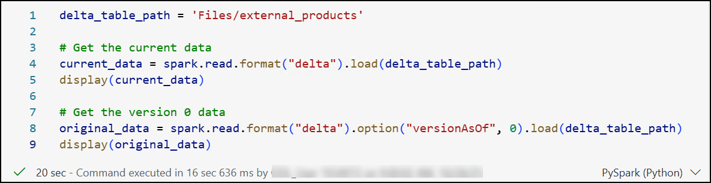
    
    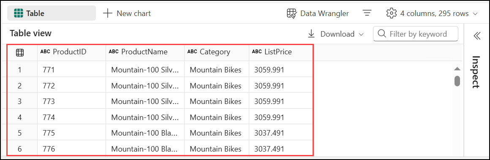
    
    

## Task 6: Use delta tables for streaming data

Delta Lake supports streaming data. Delta tables can be a *sink* or a *source* for data streams created using the Spark Structured Streaming API. In this example, you'll use a delta table as a sink for some streaming data in a simulated Internet of Things (IoT) scenario.

1. Add a new code cell in the notebook. Then, in the new cell, add the following code and run it:

    ```python
   from notebookutils import mssparkutils
   from pyspark.sql.types import *
   from pyspark.sql.functions import *

   # Create a folder
   inputPath = 'Files/data/'
   mssparkutils.fs.mkdirs(inputPath)

   # Create a stream that reads data from the folder, using a JSON schema
   jsonSchema = StructType([
   StructField("device", StringType(), False),
   StructField("status", StringType(), False)
   ])
   iotstream = spark.readStream.schema(jsonSchema).option("maxFilesPerTrigger", 1).json(inputPath)

   # Write some event data to the folder
   device_data = '''{"device":"Dev1","status":"ok"}
   {"device":"Dev1","status":"ok"}
   {"device":"Dev1","status":"ok"}
   {"device":"Dev2","status":"error"}
   {"device":"Dev1","status":"ok"}
   {"device":"Dev1","status":"error"}
   {"device":"Dev2","status":"ok"}
   {"device":"Dev2","status":"error"}
   {"device":"Dev1","status":"ok"}'''
   mssparkutils.fs.put(inputPath + "data.txt", device_data, True)
   print("Source stream created...")
    ```

    Ensure the message *Source stream created...* is printed. The code you just ran has created a streaming data source based on a folder to which some data has been saved, representing readings from hypothetical IoT devices.

    The output will look similar to this:

     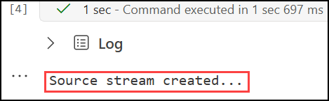

1. In a new code cell, add and run the following code:

    ```python
   # Write the stream to a delta table
   delta_stream_table_path = 'Tables/iotdevicedata'
   checkpointpath = 'Files/delta/checkpoint'
   deltastream = iotstream.writeStream.format("delta").option("checkpointLocation", checkpointpath).start(delta_stream_table_path)
   print("Streaming to delta sink...")
    ```

    This code writes the streaming device data in delta format to a folder named **iotdevicedata**. Because the path for the folder location in the **Tables** folder, a table will automatically be created for it.

    The output will look similar to this:

     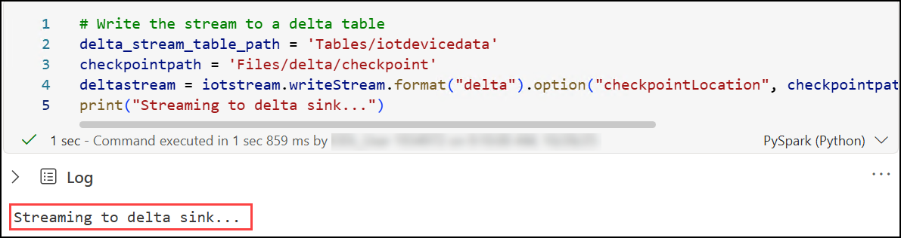

1. In a new code cell, add and run the following code:

    ```sql
   %%sql

   SELECT * FROM IotDeviceData;
    ```

    This code queries the **IotDeviceData** table, which contains the device data from the streaming source.

    The output will look similar to this:

     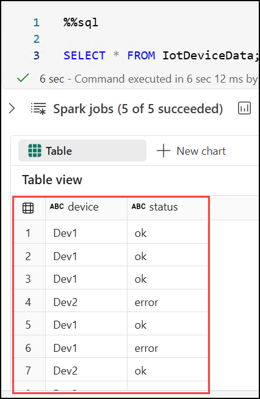

1. In a new code cell, add and run the following code:

    ```python
   # Add more data to the source stream
   more_data = '''{"device":"Dev1","status":"ok"}
   {"device":"Dev1","status":"ok"}
   {"device":"Dev1","status":"ok"}
   {"device":"Dev1","status":"ok"}
   {"device":"Dev1","status":"error"}
   {"device":"Dev2","status":"error"}
   {"device":"Dev1","status":"ok"}'''

   mssparkutils.fs.put(inputPath + "more-data.txt", more_data, True)
    ```

    This code writes more hypothetical device data to the streaming source.

    The output will look similar to this:

     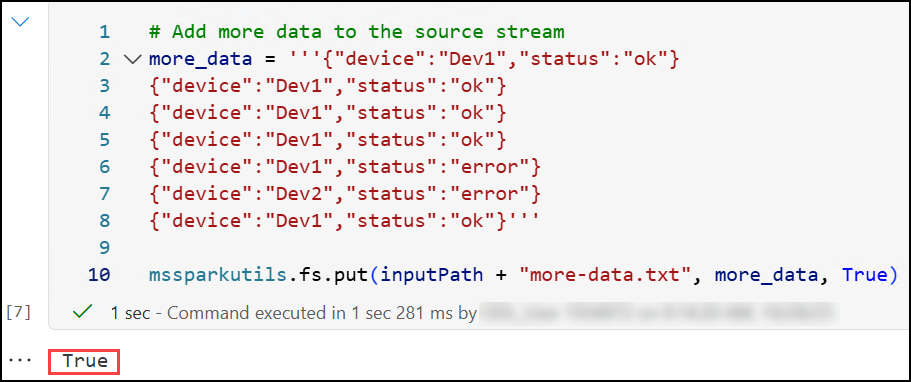

1. Re-run the cell containing the following code:

    ```sql
   %%sql

   SELECT * FROM IotDeviceData;
    ```

    This code queries the **IotDeviceData** table again, which should now include the additional data that was added to the streaming source.

1. In a new code cell, add and run the following code:

    ```python
   deltastream.stop()
    ```

    This code stops the stream.

## Summary

In this lab, you created a workspace, set up a lakehouse, and uploaded data for processing. You explored data in a DataFrame, converted it into Delta tables, and utilized Delta’s versioning and time-travel features for efficient data management. Finally, you implemented streaming data pipelines using Delta tables, gaining practical experience in ingesting, transforming, and managing data within a scalable and robust data architecture.

### You have successfully completed Lab 1. Click **Next >>** to proceed to the next lab.
