# Lab 02: Ingest data with a pipeline

### Estimated Duration: 120 Minutes

## Overview
Data pipelines define a sequence of activities that orchestrate an overall process, usually by extracting data from one or more sources and loading it into a destination; often transforming it along the way. Pipelines are commonly used to automate extract, transform, and load (ETL) processes that ingest transactional data from operational data stores into an analytical data store, such as a lakehouse or data warehouse. The graphical pipeline canvas in the Fabric user interface enables you to build complex pipelines with minimal or no coding required.

## Lab Objectives

In this lab, you will complete the following tasks:

 - Task 1: Create a pipeline
 - Task 2: Create a notebook
 - Task 3: Modify the pipeline

## _Architecture Diagram_

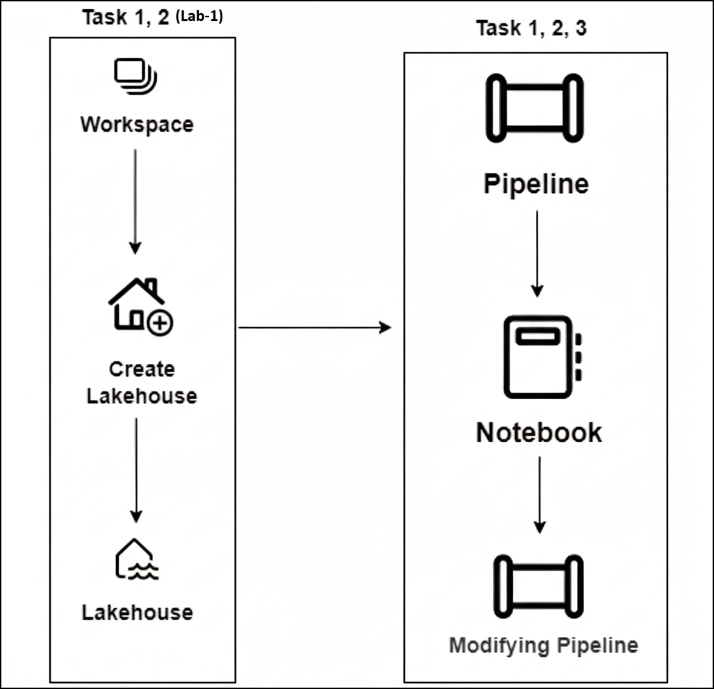

## Use Data Factory pipelines in Microsoft Fabric

A data lakehouse is a common analytical data store for cloud-scale analytics solutions. One of the core tasks of a data engineer is to implement and manage the ingestion of data from multiple operational data sources into the lakehouse. In Microsoft Fabric, you can implement *extract, transform, and load* (ETL) or *extract, load, and transform* (ELT) solutions for data ingestion through the creation of *pipelines*.

Fabric also supports Apache Spark, enabling you to write and run code to process data at scale. By combining the pipeline and Spark capabilities in Fabric, you can implement complex data ingestion logic that copies data from external sources into the OneLake storage on which the lakehouse is based, and then uses Spark code to perform custom data transformations before loading it into tables for analysis.

> **Note**: You'll need a Microsoft Fabric license to complete this exercise. Complete the previous task to proceed further.

## Task 1: Create a pipeline

A simple way to ingest data is to use a **Copy Data** activity in a pipeline to extract the data from a source and copy it to a file in the lakehouse.

1. Select your **Lakehouse (1)**, then open **Get data (2)** and choose **New pipeline (3)**.

    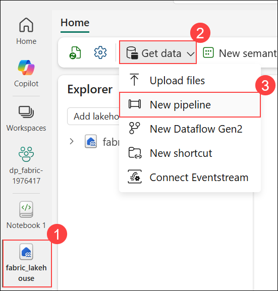

1. Create a new data pipeline named **Ingest Sales Data (1)** and click **Create (2)**.

    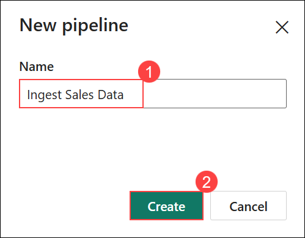

1. If the **Copy Data** wizard doesn't open automatically, select **Copy Data** in the pipeline editor page.

1. In the **Copy Data** wizard, on the **Choose a data source (1)** page, in the **New sources (2)** section, search **Http (3)** and select **Http (4)**.

    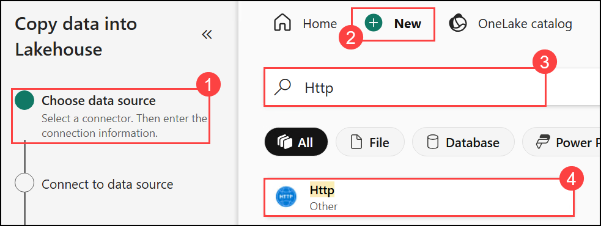

1. You will be taken to the Connect to data source pane.

1. In the **Connect to data source** pane, provide the following details:
    - **URL (1)**: `https://raw.githubusercontent.com/MicrosoftLearning/dp-data/main/sales.csv`
    - **Connection (2)**: Create new connection
    - **Connection name (3)**: *Specify a unique name*
    - **Authentication kind (4)**: Basic
    - **Username (5)**: *Enter a unique username and note it down*
    - **Password**: *Enter a unique password and note it down*
    - Select **Next (6)** to continue.

        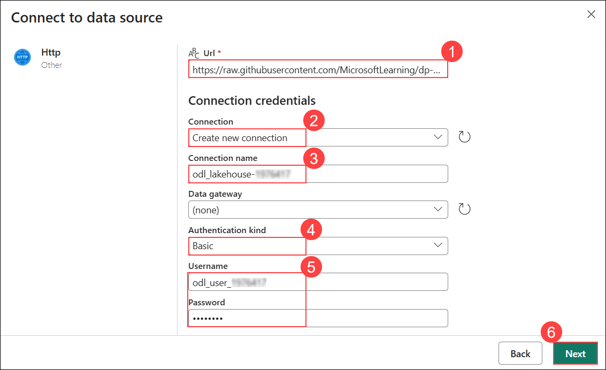

1. Set the **Request method (1)** to **GET** and leave the remaining fields unchanged. Select **Next (2)** to continue.

    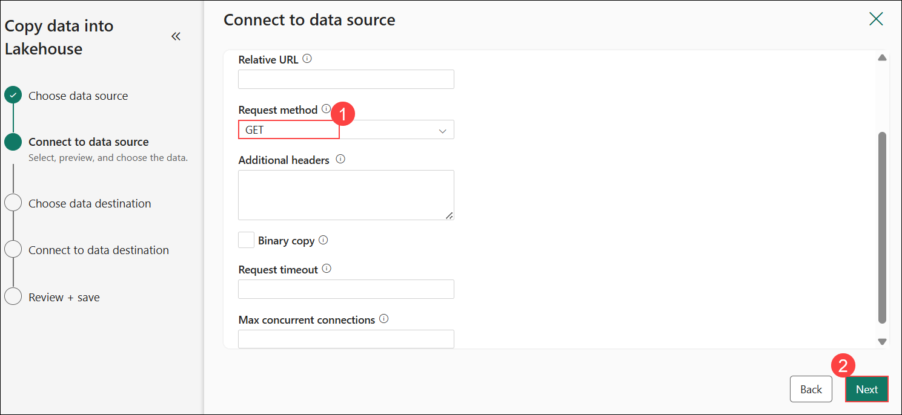

1. After the data is sampled, verify the following settings:
    - **File format (1)**: DelimitedText
    - **Column delimiter (2)**: Comma (,)
    - **Row delimiter (3)**: Default (\r, \n, or \r\n)
    - **First row as header (4)**: Selected
    - **Compression type (5)**: No compression  
    Then select **Next (6)**.

        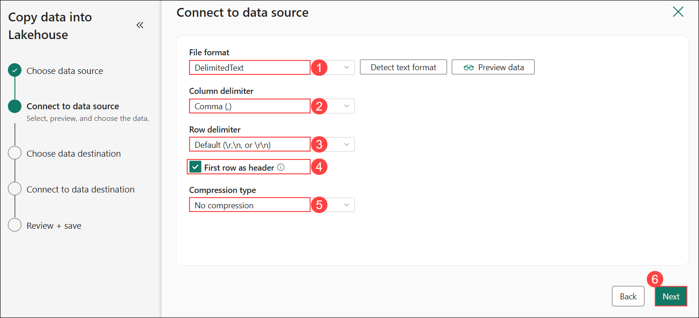

1. Select **Preview data** to see a sample of the data that will be ingested. Then close the data preview and select **Next**.

1. On the **Choose data destination** page, select your existing lakehouse.

    

    >**Note:** If the Fabric lakehouse is already selected, continue to the next steps.

1. Configure the data destination with the following settings:
    - **Root folder (1)**: Files
    - **Folder path (2)**: new_data
    - **File name (3)**: sales.csv
    - **Copy behavior**: None  
    Then select **Next (4)**.

        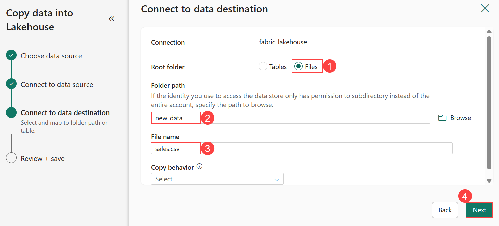

1. On the **Copy summary** page, review the details of your copy operation and then select **Save + Run**.

1. A new pipeline containing a **Copy Data** activity is created:

    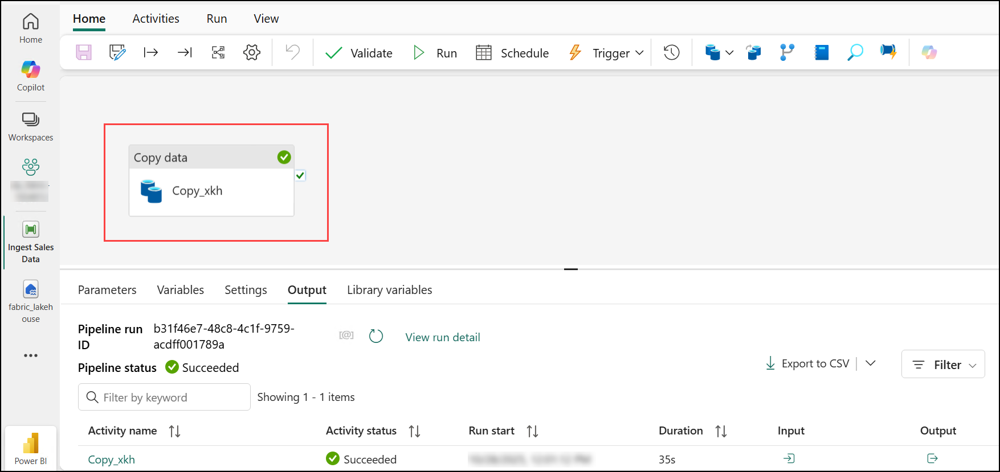

1. When the pipeline starts to run, you can monitor its status in the **Output** pane under the pipeline designer. Use the **&#8635;** (*Refresh*) icon to refresh the status, and wait until it has succeeded.

    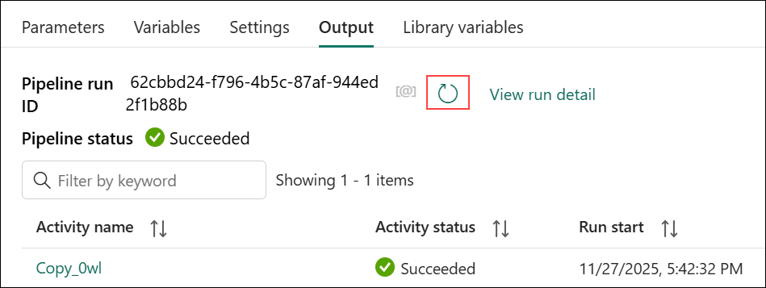

1. In the menu bar on the left, select your **Lakehouse**.

    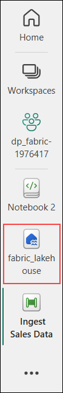

1. Expand **Files (1)** and select the **new_data (2)** folder to verify that the **sales.csv (3)** file has been copied.

    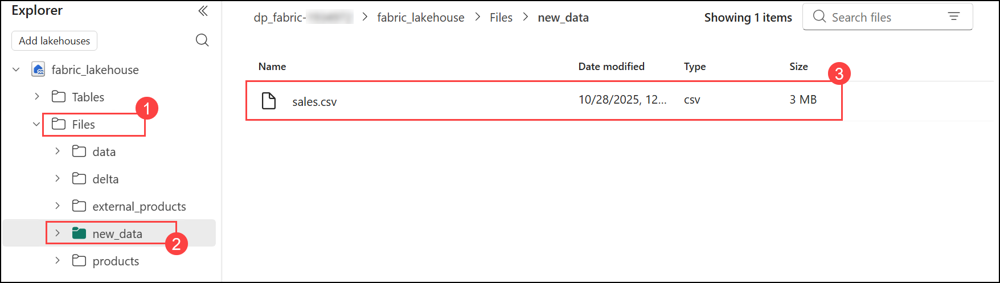

## Task 2: Create a notebook

1. On the **Home** page for your lakehouse, in the **Open notebook (1)** menu, select **New notebook (2)**.

   

    After a few seconds, a new notebook containing a single *cell* will open. Notebooks are made up of one or more cells that can contain *code* or *markdown* (formatted text).

1. Select the existing cell in the notebook, which contains some simple code, and then replace the default code with the following variable declaration.

    ```python
   table_name = "sales"
    ```

1. Open the **ellipsis (1)** menu for the cell and select **Toggle parameter cell (2)** to mark this cell as a parameter cell for pipeline runs.

    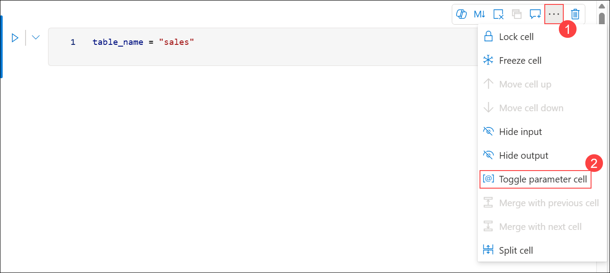

1. Below the parameters cell, select **+ Code (1)** to insert a new code cell, then paste the transformation code into that cell (2).

    ```python
   from pyspark.sql.functions import *

   # Read the new sales data
   df = spark.read.format("csv").option("header","true").load("Files/new_data/*.csv")

   ## Add month and year columns
   df = df.withColumn("Year", year(col("OrderDate"))).withColumn("Month", month(col("OrderDate")))

   # Derive FirstName and LastName columns
   df = df.withColumn("FirstName", split(col("CustomerName"), " ").getItem(0)).withColumn("LastName", split(col("CustomerName"), " ").getItem(1))

   # Filter and reorder columns
   df = df["SalesOrderNumber", "SalesOrderLineNumber", "OrderDate", "Year", "Month", "FirstName", "LastName", "EmailAddress", "Item", "Quantity", "UnitPrice", "TaxAmount"]

   # Load the data into a table
   df.write.format("delta").mode("append").saveAsTable(table_name)
    ```

    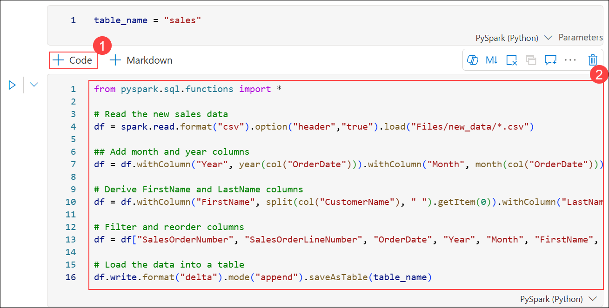

    This code loads the data from the sales.csv file that was ingested by the **Copy Data** activity, applies some transformation logic, and saves the transformed data as a table - appending the data if the table already exists.

1. Verify that your notebooks look similar to this, and then use the **&#9655; Run all** button on the toolbar to run all of the cells it contains.

    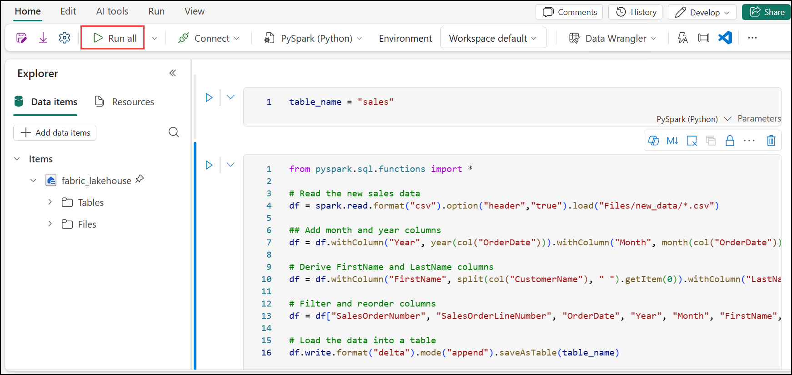

1. After the notebook run completes, open the ⚙️ **Settings (1)** panel and update the **Name (2)** of the notebook to **Load Sales**, then close the pane.

    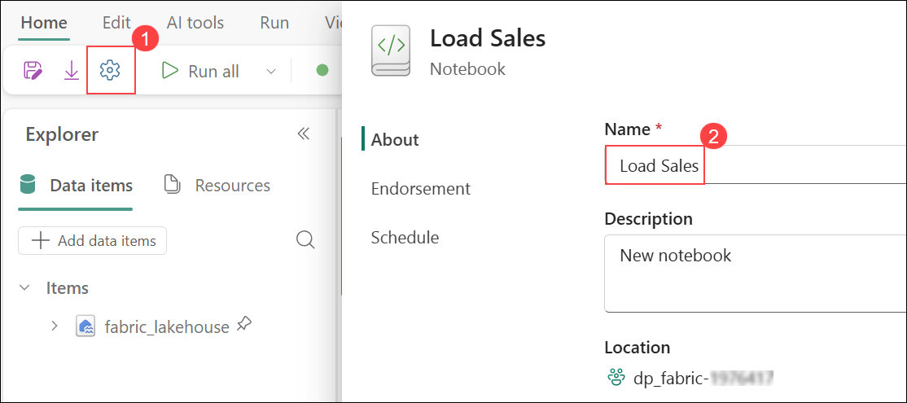

1. In the hub menu bar on the left, select your lakehouse.

1. In the **Explorer** pane, refresh the view. Then expand **Tables (1)**, and select the **sales (2)** table to see a preview of the data it contains.

   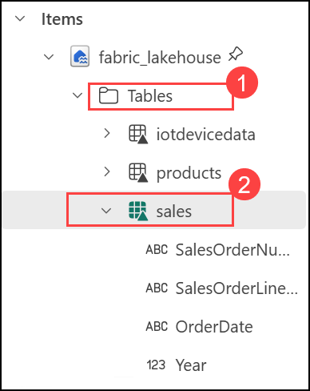

## Task 3: Modify the pipeline

Now that you've implemented a notebook to transform data and load it into a table, you can incorporate the notebook into a pipeline to create a reusable ETL process.

1. In the hub menu bar on the left, select the **Ingest Sales Data** pipeline you created previously.

1. Open the **Activities (1)** tab, select the **More activities (2)** menu, and choose **Delete data (3)**. Drag the new Delete data activity to the left of the Copy data activity and connect its **On completion** output to Copy data.

    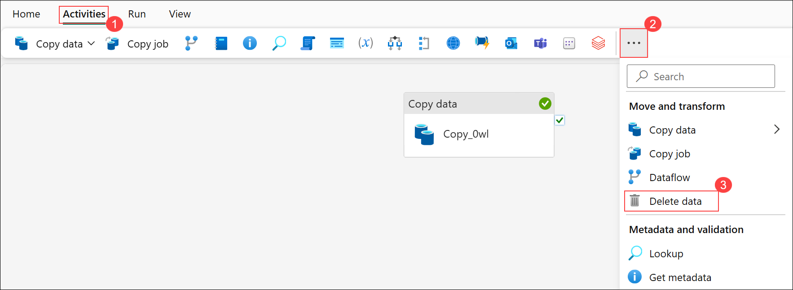

    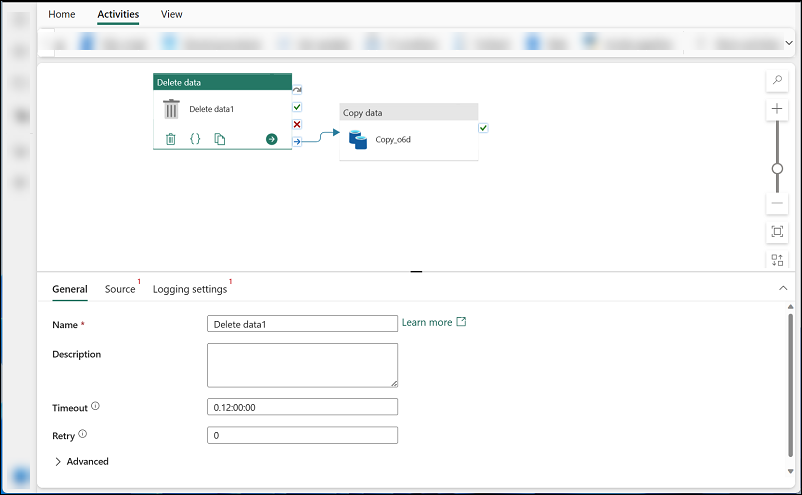

1. Select the **Delete data** activity and, in the pane below the canvas, set **General (1)** → **Name (2)** to **Delete old files**.

    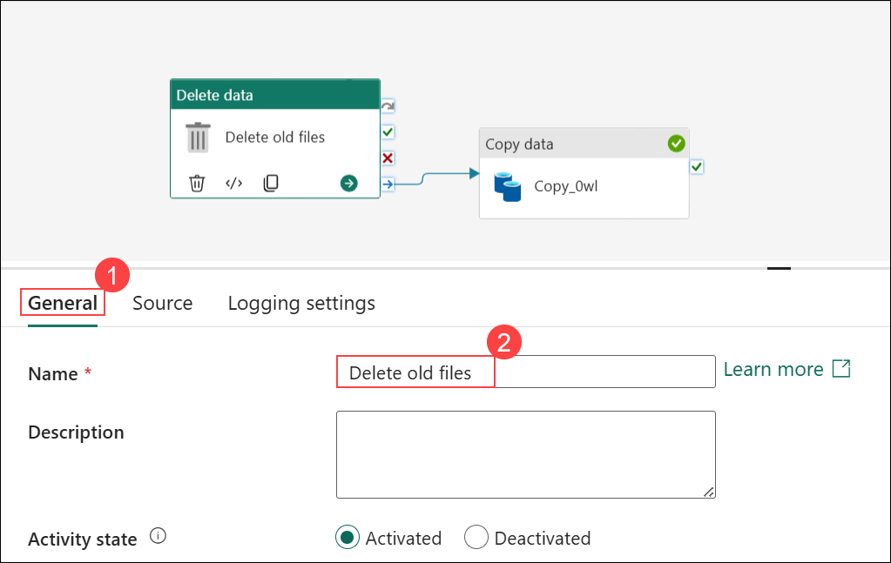

1. In the **Source (1)** section, configure the following:
    - **Connection (2)**: Your lakehouse connection  
    - **Lakehouse (3)**: Select your lakehouse  
    - **File path type (4)**: Wildcard file path  
    - **Folder path (5)**: Files/new_data
    - **Wildcard file name (6)**: *.csv  
    - **Recursively (7)**: Selected

        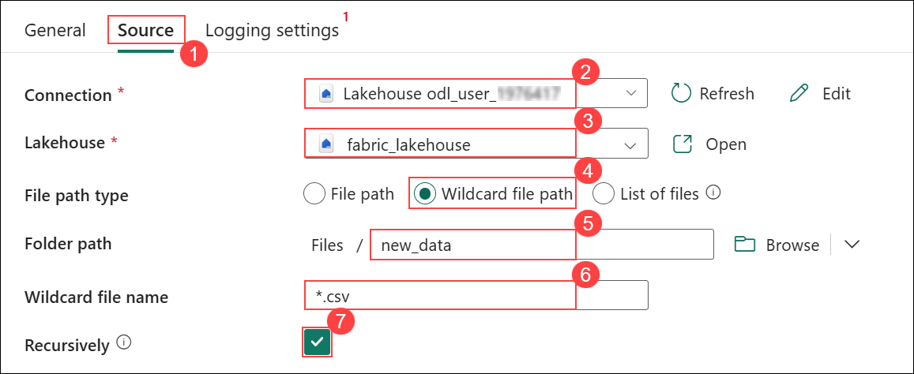

1. In the **Logging settings**, ensure **Enable logging** is **unselected**.

    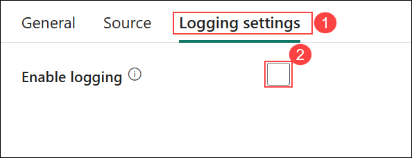

    **Note:** These settings will ensure that any existing .csv files are deleted before copying the **sales.csv** file.

1. In the pipeline designer, select **Notebook** to add a **Notebook** activity to the pipeline.

    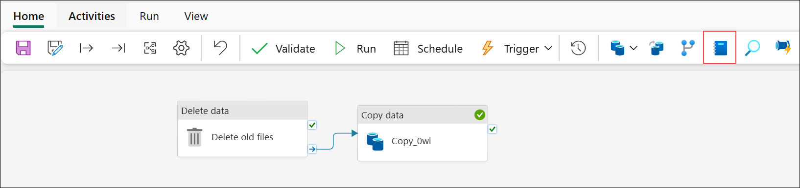

1. Select the **Copy data** activity and then connect its **On completion** output to the **Notebook** activity as shown here:

    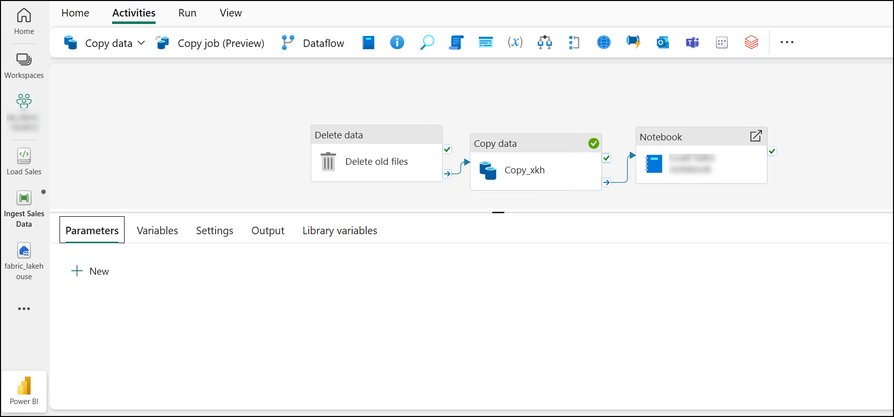

1. Select the **Notebook** activity, and then in the pane below the design canvas, set the following properties:
    - **General**:
        - **Name**: Load Sales notebook

            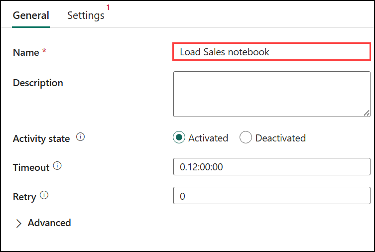
    
    - **Settings**:
        - **Notebook (1)**: Load Sales
        - **Base parameters (2)**: *Add a new parameter with the following properties:*
            
            | Name | Type | Value |
            | -- | -- | -- |
            | table_name | String | new_sales |

            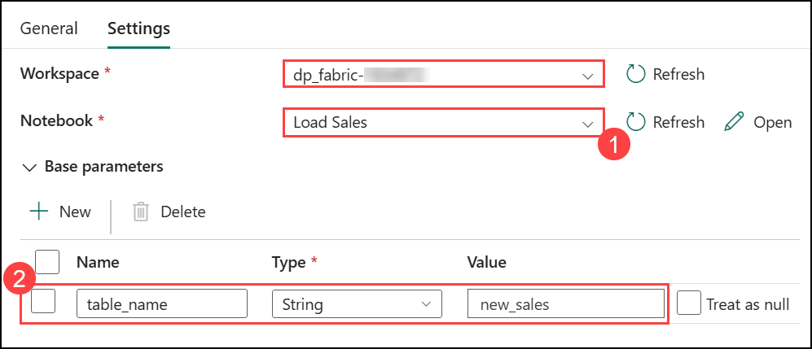

    The **table_name** parameter will be passed to the notebook and override the default value assigned to the **table_name** variable in the parameters cell.

1. On the **Home** tab, use the **&#128427;** (*Save*) icon to save the pipeline. Then use the **&#9655; Run** button to run the pipeline, and wait for all of the activities to complete.

    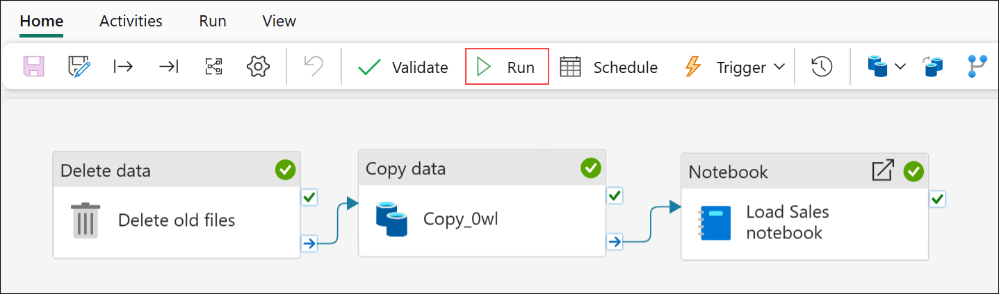

1. In the hub menu bar on the left edge of the portal, select your lakehouse.

1. In the **Explorer** pane, expand **Tables** and select the **new_sales** table to see a preview of the data it contains. This table was created by the notebook when it was run by the pipeline.

   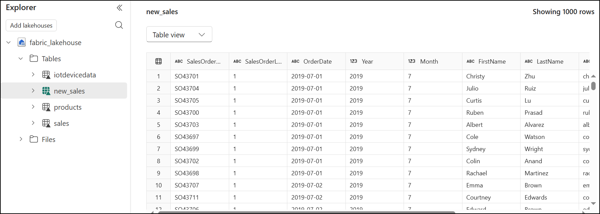

In this exercise, you implemented a data ingestion solution that uses a pipeline to copy data to your lakehouse from an external source, and then uses a Spark notebook to transform the data and load it into a table.

## Summary

In this lab, you created a pipeline to automate data processing, developed a notebook for writing and testing your pipeline logic, and then modified the pipeline to refine its functionality. These tasks helped you gain practical experience in building and optimizing data workflows within a pipeline.

### You have successfully completed the lab.
